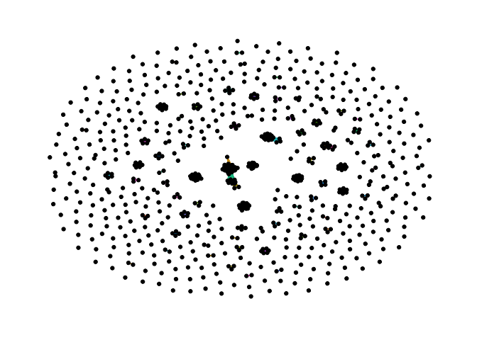

Exercise 1
================

## 1. Get contact data

Get a copy of connections data
<https://www.linkedin.com/psettings/member-data>

## 2. Load Data

``` r
connections <- read.csv("Connections_fixed.csv")
view(connections)
```

## 3. Get count of contacts by employer

``` r
library(dplyr)
connections %>% count(Company) %>% arrange(-n) %>% head(20)
```

    ##                                                Company  n
    ## 1                                            Accenture 45
    ## 2  McGill University - Desautels Faculty of Management 18
    ## 3                                                      17
    ## 4                                             Deloitte 13
    ## 5                                  Deloitte Consulting 13
    ## 6                                                 HSBC 11
    ## 7                                                  AIA  7
    ## 8                                       Deloitte China  7
    ## 9                                       Hang Seng Bank  7
    ## 10                    PwC Mainland China and Hong Kong  7
    ## 11                                                  EY  6
    ## 12                               Rogers Communications  6
    ## 13                                         Air Transat  5
    ## 14                                          Crypto.com  5
    ## 15                                            DBS Bank  5
    ## 16     Hong Kong Exchanges and Clearing Limited (HKEX)  5
    ## 17                                            Novartis  5
    ## 18                                                 PwC  5
    ## 19                                          Scotiabank  5
    ## 20                                        Sia Partners  5

``` r
#connections %>% group_by(Company) %>% summarise(count_contacts = n()) %>%  arrange(desc(count_contacts)) 
```

## 4. Create nodes and edges dataframes to use with igraph

``` r
library(tidygraph)
```

    ## 
    ## Attaching package: 'tidygraph'

    ## The following object is masked from 'package:stats':
    ## 
    ##     filter

``` r
library(ggraph)

# Create labels
connections$initial = substr(connections$Last.Name, 1,1)
connections = connections %>% 
  mutate(name = paste(First.Name, initial, sep = " "))

# Create nodes
nodes <- connections %>% 
  select(c("name", "Company")) %>% 
  rowid_to_column("id")

# Create edges
edges <- connections %>% select(c(name, Company)) %>% 
  left_join(nodes %>% select(c(id,name)), by = c("name"="name"))

edges <- edges %>% left_join(edges, by = "Company", keep=FALSE) %>% 
  select(c("id.x", "id.y", "Company")) %>% 
  filter(id.x!=id.y)

colnames(edges) <- c("x", "y", "Company")

view(edges)
```

## 5. Plot the resulting network

``` r
network <- tbl_graph(nodes=nodes, edges=edges, directed=FALSE)

ggraph(network, layout = "graphopt") + 
  geom_edge_link(aes(color=Company), show.legend=FALSE) + 
  geom_node_point()+
  theme_graph()
```

<!-- -->
