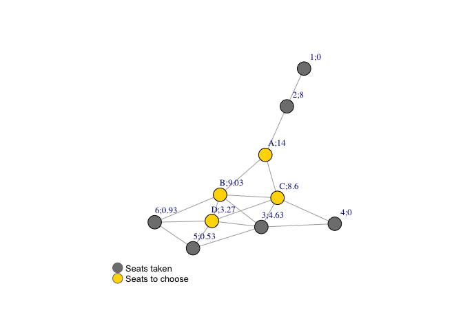
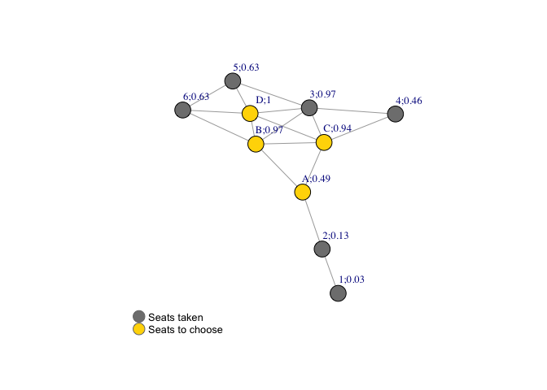

Exercise 2 - Fakebook Bus
================

## Nodes and Edges Creation

Load libraries

``` r
library(igraph)
```

    ## 
    ## Attaching package: 'igraph'

    ## The following objects are masked from 'package:stats':
    ## 
    ##     decompose, spectrum

    ## The following object is masked from 'package:base':
    ## 
    ##     union

``` r
library(tidyverse)
```

    ## ── Attaching packages ─────────────────────────────────────── tidyverse 1.3.1 ──

    ## ✓ ggplot2 3.3.5     ✓ purrr   0.3.4
    ## ✓ tibble  3.1.5     ✓ dplyr   1.0.7
    ## ✓ tidyr   1.1.4     ✓ stringr 1.4.0
    ## ✓ readr   2.0.2     ✓ forcats 0.5.1

    ## ── Conflicts ────────────────────────────────────────── tidyverse_conflicts() ──
    ## x dplyr::as_data_frame() masks tibble::as_data_frame(), igraph::as_data_frame()
    ## x purrr::compose()       masks igraph::compose()
    ## x tidyr::crossing()      masks igraph::crossing()
    ## x dplyr::filter()        masks stats::filter()
    ## x dplyr::groups()        masks igraph::groups()
    ## x dplyr::lag()           masks stats::lag()
    ## x purrr::simplify()      masks igraph::simplify()

Create nodes for each seat, where seats 1-6 are seats taken and A-D are
seat choices

``` r
node_list <- data.frame(nodes = c("1","2","3","4","5","6","A","B","C","D"))
node_list
```

    ##    nodes
    ## 1      1
    ## 2      2
    ## 3      3
    ## 4      4
    ## 5      5
    ## 6      6
    ## 7      A
    ## 8      B
    ## 9      C
    ## 10     D

Create edges between each pair of adjacent seats

``` r
edge_list <- data.frame(from = 
                          c("1","2","2","3","3","3","3","3","4","4","5","5","5","6","6","6","A","A","A",
                            "B","B","B","B","B","C","C","C","C","C","D","D","D","D","D"), 
                        to =
                          c("2","1","A","4","5","B","C","D","3","3","3","6","D","5","B","D","2","B","C",
                            "3","6","A","C","D","3","4","A","B","D","3","5","6","B","C"))
edge_list %>% head()
```

    ##   from to
    ## 1    1  2
    ## 2    2  1
    ## 3    2  A
    ## 4    3  4
    ## 5    3  5
    ## 6    3  B

Since the network is undirected, we can remove either direction to avoid
double counting in centrality.

``` r
edge_list <- igraph::as_data_frame(igraph::simplify(graph_from_data_frame(edge_list, directed=FALSE)))
```

Transform the dataframe into graph

``` r
fakebook <- graph_from_data_frame(d = edge_list, vertices = node_list, directed = FALSE)
fakebook
```

    ## IGRAPH 23bbb4d UN-- 10 17 -- 
    ## + attr: name (v/c)
    ## + edges from 23bbb4d (vertex names):
    ##  [1] 1--2 2--A 3--4 3--5 3--B 3--C 3--D 4--C 5--6 5--D 6--B 6--D A--B A--C B--C
    ## [16] B--D C--D

Plot the network

``` r
V(fakebook)$color <-c(rep("gray50",6),rep("gold",4))
plot(fakebook)
legend(x=-1.5, y=-1.1, c("Seats taken","Seats to choose"), pch=21,
col="#777777", pt.bg=c("gray50","gold"), pt.cex=2, cex=.8, bty="n", ncol=1)
```

<!-- -->

## Various Measures of Centrality & Visualisation

### (i) Betweenness Centrality

Calculate Betweenness Centrality, which measures the extent to which a
node lies on paths between other nodes.

``` r
V(fakebook)$bc <- betweenness(fakebook)
V(fakebook)$bc
```

    ##  [1]  0.0000000  8.0000000  4.6333333  0.0000000  0.5333333  0.9333333
    ##  [7] 14.0000000  9.0333333  8.6000000  3.2666667

Plot the network graph with labels and Betweenness Centrality values

``` r
label <- paste(V(fakebook)$name, round(V(fakebook)$bc,2), sep=";")
plot(fakebook, vertex.label = label, vertex.label.cex=0.8, vertex.label.dist=2.5)
legend(x=-1.5, y=-1.1, c("Seats taken","Seats to choose"), pch=21,
col="#777777", pt.bg=c("gray50","gold"), pt.cex=2, cex=.8, bty="n", ncol=1)
```

<!-- -->

### (ii) Degree Centrality

Calculate Degree Centrality, a measure for a node in a network is just
its degree, the number of edges connected to it.

``` r
V(fakebook)$dc <- degree(fakebook)
V(fakebook)$dc
```

    ##  [1] 1 2 5 2 3 3 3 5 5 5

Plot the network graph with labels and Degree Centrality values

``` r
label <- paste(V(fakebook)$name, round(V(fakebook)$dc,2), sep=";")
plot(fakebook, vertex.label = label, vertex.label.cex=0.8, vertex.label.dist=2.5)
legend(x=-1.5, y=-1.1, c("Seats taken","Seats to choose"), pch=21,
col="#777777", pt.bg=c("gray50","gold"), pt.cex=2, cex=.8, bty="n", ncol=1)
```

<!-- --> \#\#\#
(iii) Eigenvector Centrality Calculate Eigenvector Centrality, which
awards a number of points proportional to the centrality scores of the
neighbors

``` r
V(fakebook)$ec <- evcent(fakebook)
```

    ## Warning in vattrs[[name]][index] <- value: number of items to replace is not a
    ## multiple of replacement length

``` r
unlist(V(fakebook)$ec[1])
```

    ##          1          2          3          4          5          6          A 
    ## 0.03059284 0.12661070 0.96744261 0.46122992 0.62726236 0.62852844 0.49339477 
    ##          B          C          D 
    ## 0.97394849 0.94139110 1.00000000

Plot the network graph with labels and Closeness Centrality values

``` r
label <- paste(V(fakebook)$name, round(unlist(V(fakebook)$ec[1]),2), sep=";")
plot(fakebook, vertex.label = label, vertex.label.cex=0.8, vertex.label.dist=2.5)
legend(x=-1.5, y=-1.1, c("Seats taken","Seats to choose"), pch=21,
col="#777777", pt.bg=c("gray50","gold"), pt.cex=2, cex=.8, bty="n", ncol=1)
```

<!-- -->

### (iv) Closeness Centrality

Calculate Closeness Centrality, a centrality score that measures the
mean distance from a node to other nodes.

``` r
V(fakebook)$cc <- closeness(fakebook)
V(fakebook)$cc
```

    ##  [1] 0.03333333 0.04545455 0.06250000 0.05000000 0.04761905 0.05263158
    ##  [7] 0.06250000 0.07142857 0.07142857 0.06250000

Plot the network graph with labels and Closeness Centrality values

``` r
label <- paste(V(fakebook)$name, round(V(fakebook)$cc,2), sep=";")
plot(fakebook, vertex.label = label, vertex.label.cex=0.8, vertex.label.dist=2.5)
legend(x=-1.5, y=-1.1, c("Seats taken","Seats to choose"), pch=21,
col="#777777", pt.bg=c("gray50","gold"), pt.cex=2, cex=.8, bty="n", ncol=1)
```

<!-- -->

## Choice of a Seat

Considering the 4 centrality measures, we can summarize the following
benefits for the 4 seats to choose.

1.  Betweenness Centrality: A (14.00) &gt; B (9.03) &gt; C (8.6) &gt; D
    (3.27). A is on the most shortest paths the nodes lie on and has the
    greatest influence over the flow of information between seats,
    followed by B. This might be useful in leading / facilitating group
    communications but less important in individual networking scenario.

2.  Degree Centrality: B (5) = C (5) = D (5) &gt; A (3). We can talk to
    5 adjacent persons sitting at B / C / D to maximize the number of
    connections, while only 3 at A. This is crucial in developing
    informal connections on Fakebook bus.

3.  Eigenvector Centrality: D (1) &gt; B (0.97) &gt; C (0.94) &gt; A
    (0.49). We can consider high eigenvector centrality with seats D / B
    / C if we want to network with important person who knows more
    people from adjacent seats. This might not directly applicable to
    building informal connections through adjacent seating, and is hence
    a reference than a determining factor.

4.  Closeness Centrality: B (0.07) = C (0.07) &gt; A (0.06) = D (0.06).
    B / C has the shortest mean distance from a node to another node.
    It’s often used in social and other network studies and supports
    seat selection in our case.

Overall, I would choose seat B which is located at the centre,because it
has the highest degree centrality and closeness centrality, and
relatively high betweeness centrality.Through seat B, we can enjoy the
benefit of building up the maximum 5 informal connections with adjacent
seats. It also has the advantage to extend further connections through
seat A and seat D once bonding is established, which is critical to pass
on messages with seats 1 & 2 in the front and of similar mean distance
reaching out to all seats respectively to co-create the Fakebook bus
vibes.

Yet, choosing seat B would be not so beneficial if the bus is not fully
loaded, perhaps someone call in sick or choose other transportation
alternative. For example, if seat A is empty, the highest degree
centrality will go to seat D, making B a less appealing choice. Other
factors like how influential the person is (personality, job title,
department, etc.), their willingness to mingle and actual time they sit
next to you shall also be taken into consideration in real life
scenarios.
