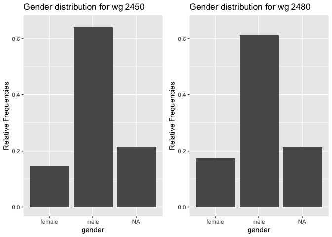
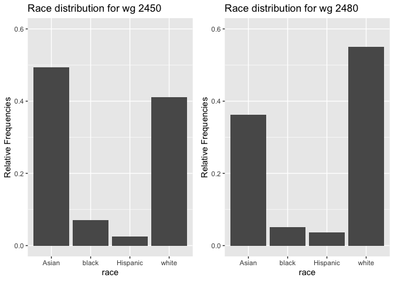
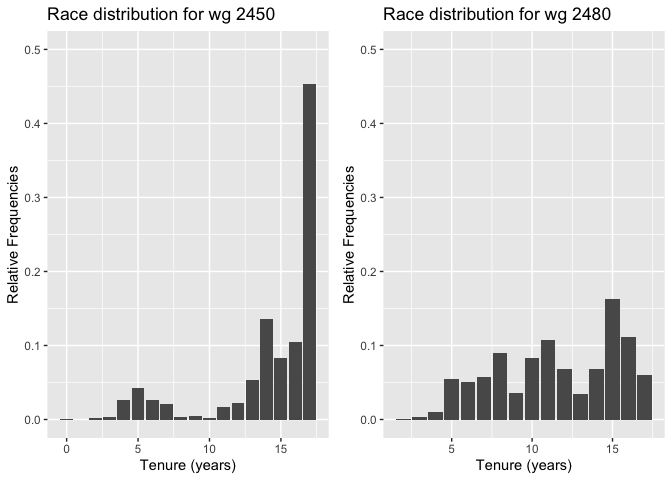
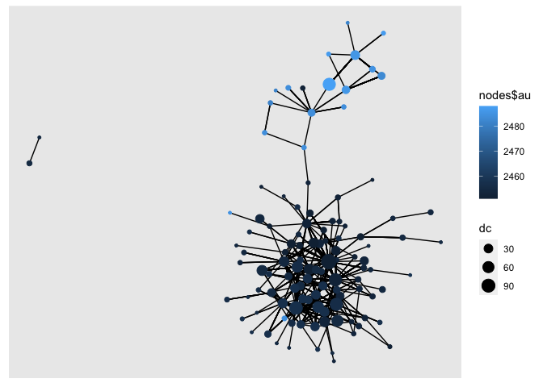
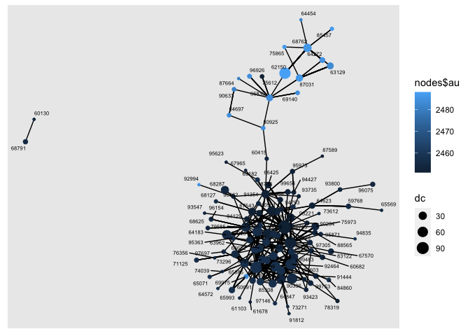

Exercise 3
================

## 1. Load the files and add gender, race and tenure for examiners

### Load data

Load the following data: + applications from `app_data_sample.parquet` +
edges from `edges_sample.csv`

``` r
applications <- read_parquet("app_data_sample.parquet")
edges <- read_csv("edges_sample.csv")
```

    ## Rows: 32906 Columns: 4

    ## ── Column specification ────────────────────────────────────────────────────────
    ## Delimiter: ","
    ## chr  (1): application_number
    ## dbl  (2): ego_examiner_id, alter_examiner_id
    ## date (1): advice_date

    ## 
    ## ℹ Use `spec()` to retrieve the full column specification for this data.
    ## ℹ Specify the column types or set `show_col_types = FALSE` to quiet this message.

``` r
applications
```

    ## # A tibble: 2,018,477 × 16
    ##    application_number filing_date examiner_name_last examiner_name_first
    ##    <chr>              <date>      <chr>              <chr>              
    ##  1 08284457           2000-01-26  HOWARD             JACQUELINE         
    ##  2 08413193           2000-10-11  YILDIRIM           BEKIR              
    ##  3 08531853           2000-05-17  HAMILTON           CYNTHIA            
    ##  4 08637752           2001-07-20  MOSHER             MARY               
    ##  5 08682726           2000-04-10  BARR               MICHAEL            
    ##  6 08687412           2000-04-28  GRAY               LINDA              
    ##  7 08716371           2004-01-26  MCMILLIAN          KARA               
    ##  8 08765941           2000-06-23  FORD               VANESSA            
    ##  9 08776818           2000-02-04  STRZELECKA         TERESA             
    ## 10 08809677           2002-02-20  KIM                SUN                
    ## # … with 2,018,467 more rows, and 12 more variables:
    ## #   examiner_name_middle <chr>, examiner_id <dbl>, examiner_art_unit <dbl>,
    ## #   uspc_class <chr>, uspc_subclass <chr>, patent_number <chr>,
    ## #   patent_issue_date <date>, abandon_date <date>, disposal_type <chr>,
    ## #   appl_status_code <dbl>, appl_status_date <chr>, tc <dbl>

``` r
edges
```

    ## # A tibble: 32,906 × 4
    ##    application_number advice_date ego_examiner_id alter_examiner_id
    ##    <chr>              <date>                <dbl>             <dbl>
    ##  1 09402488           2008-11-17            84356             66266
    ##  2 09402488           2008-11-17            84356             63519
    ##  3 09402488           2008-11-17            84356             98531
    ##  4 09445135           2008-08-21            92953             71313
    ##  5 09445135           2008-08-21            92953             93865
    ##  6 09445135           2008-08-21            92953             91818
    ##  7 09479304           2008-12-15            61767             69277
    ##  8 09479304           2008-12-15            61767             92446
    ##  9 09479304           2008-12-15            61767             66805
    ## 10 09479304           2008-12-15            61767             70919
    ## # … with 32,896 more rows

### Get gender for examiners

We’ll get gender based on the first name of the examiner, which is
recorded in the field `examiner_name_first`. We’ll use library `gender`
for that, relying on a modified version of their own
[example](https://cran.r-project.org/web/packages/gender/vignettes/predicting-gender.html).

Note that there are over 2 million records in the applications table –
that’s because there are many records for each examiner, as many as the
number of applications that examiner worked on during this time frame.
Our first step therefore is to get all *unique* names in a separate list
`examiner_names`. We will then guess gender for each one and will join
this table back to the original dataset. So, let’s get names without
repetition:

``` r
library(gender)
#install_genderdata_package() # only run this line the first time you use the package, to get data for it
# get a list of first names without repetitions
examiner_names <- applications %>% 
  distinct(examiner_name_first)
examiner_names
```

    ## # A tibble: 2,595 × 1
    ##    examiner_name_first
    ##    <chr>              
    ##  1 JACQUELINE         
    ##  2 BEKIR              
    ##  3 CYNTHIA            
    ##  4 MARY               
    ##  5 MICHAEL            
    ##  6 LINDA              
    ##  7 KARA               
    ##  8 VANESSA            
    ##  9 TERESA             
    ## 10 SUN                
    ## # … with 2,585 more rows

Now let’s use function `gender()` as shown in the example for the
package to attach a gender and probability to each name and put the
results into the table `examiner_names_gender`

``` r
# get a table of names and gender
examiner_names_gender <- examiner_names %>% 
  do(results = gender(.$examiner_name_first, method = "ssa")) %>% 
  unnest(cols = c(results), keep_empty = TRUE) %>% 
  select(
    examiner_name_first = name,
    gender,
    proportion_female
  )
examiner_names_gender
```

    ## # A tibble: 1,822 × 3
    ##    examiner_name_first gender proportion_female
    ##    <chr>               <chr>              <dbl>
    ##  1 AARON               male              0.0082
    ##  2 ABDEL               male              0     
    ##  3 ABDOU               male              0     
    ##  4 ABDUL               male              0     
    ##  5 ABDULHAKIM          male              0     
    ##  6 ABDULLAH            male              0     
    ##  7 ABDULLAHI           male              0     
    ##  8 ABIGAIL             female            0.998 
    ##  9 ABIMBOLA            female            0.944 
    ## 10 ABRAHAM             male              0.0031
    ## # … with 1,812 more rows

Finally, let’s join that table back to our original applications data
and discard the temporary tables we have just created to reduce clutter
in our environment.

``` r
# remove extra colums from the gender table
examiner_names_gender <- examiner_names_gender %>% 
  select(examiner_name_first, gender)
# joining gender back to the dataset
applications <- applications %>% 
  left_join(examiner_names_gender, by = "examiner_name_first")
# cleaning up
rm(examiner_names)
rm(examiner_names_gender)
gc()
```

    ##            used  (Mb) gc trigger  (Mb) limit (Mb) max used  (Mb)
    ## Ncells  4545782 242.8    7898177 421.9         NA  4872494 260.3
    ## Vcells 49589663 378.4   95518638 728.8     102400 79905204 609.7

### Guess the examiner’s race

We’ll now use package `wru` to estimate likely race of an examiner. Just
like with gender, we’ll get a list of unique names first, only now we
are using surnames.

``` r
library(wru)
examiner_surnames <- applications %>% 
  select(surname = examiner_name_last) %>% 
  distinct()
examiner_surnames
```

    ## # A tibble: 3,806 × 1
    ##    surname   
    ##    <chr>     
    ##  1 HOWARD    
    ##  2 YILDIRIM  
    ##  3 HAMILTON  
    ##  4 MOSHER    
    ##  5 BARR      
    ##  6 GRAY      
    ##  7 MCMILLIAN 
    ##  8 FORD      
    ##  9 STRZELECKA
    ## 10 KIM       
    ## # … with 3,796 more rows

We’ll follow the instructions for the package outlined here
<https://github.com/kosukeimai/wru>.

``` r
examiner_race <- predict_race(voter.file = examiner_surnames, surname.only = T) %>% 
  as_tibble()
```

    ## [1] "Proceeding with surname-only predictions..."

    ## Warning in merge_surnames(voter.file): Probabilities were imputed for 698
    ## surnames that could not be matched to Census list.

``` r
examiner_race
```

    ## # A tibble: 3,806 × 6
    ##    surname    pred.whi pred.bla pred.his pred.asi pred.oth
    ##    <chr>         <dbl>    <dbl>    <dbl>    <dbl>    <dbl>
    ##  1 HOWARD       0.643   0.295    0.0237   0.005     0.0333
    ##  2 YILDIRIM     0.861   0.0271   0.0609   0.0135    0.0372
    ##  3 HAMILTON     0.702   0.237    0.0245   0.0054    0.0309
    ##  4 MOSHER       0.947   0.00410  0.0241   0.00640   0.0185
    ##  5 BARR         0.827   0.117    0.0226   0.00590   0.0271
    ##  6 GRAY         0.687   0.251    0.0241   0.0054    0.0324
    ##  7 MCMILLIAN    0.359   0.574    0.0189   0.00260   0.0463
    ##  8 FORD         0.620   0.32     0.0237   0.0045    0.0313
    ##  9 STRZELECKA   0.666   0.0853   0.137    0.0797    0.0318
    ## 10 KIM          0.0252  0.00390  0.00650  0.945     0.0198
    ## # … with 3,796 more rows

As you can see, we get probabilities across five broad US Census
categories: white, black, Hispanic, Asian and other. (Some of you may
correctly point out that Hispanic is not a race category in the US
Census, but these are the limitations of this package.)

Our final step here is to pick the race category that has the highest
probability for each last name and then join the table back to the main
applications table. See this example for comparing values across
columns: <https://www.tidyverse.org/blog/2020/04/dplyr-1-0-0-rowwise/>.
And this one for `case_when()` function:
<https://dplyr.tidyverse.org/reference/case_when.html>.

``` r
examiner_race <- examiner_race %>% 
  mutate(max_race_p = pmax(pred.asi, pred.bla, pred.his, pred.oth, pred.whi)) %>% 
  mutate(race = case_when(
    max_race_p == pred.asi ~ "Asian",
    max_race_p == pred.bla ~ "black",
    max_race_p == pred.his ~ "Hispanic",
    max_race_p == pred.oth ~ "other",
    max_race_p == pred.whi ~ "white",
    TRUE ~ NA_character_
  ))
examiner_race
```

    ## # A tibble: 3,806 × 8
    ##    surname    pred.whi pred.bla pred.his pred.asi pred.oth max_race_p race 
    ##    <chr>         <dbl>    <dbl>    <dbl>    <dbl>    <dbl>      <dbl> <chr>
    ##  1 HOWARD       0.643   0.295    0.0237   0.005     0.0333      0.643 white
    ##  2 YILDIRIM     0.861   0.0271   0.0609   0.0135    0.0372      0.861 white
    ##  3 HAMILTON     0.702   0.237    0.0245   0.0054    0.0309      0.702 white
    ##  4 MOSHER       0.947   0.00410  0.0241   0.00640   0.0185      0.947 white
    ##  5 BARR         0.827   0.117    0.0226   0.00590   0.0271      0.827 white
    ##  6 GRAY         0.687   0.251    0.0241   0.0054    0.0324      0.687 white
    ##  7 MCMILLIAN    0.359   0.574    0.0189   0.00260   0.0463      0.574 black
    ##  8 FORD         0.620   0.32     0.0237   0.0045    0.0313      0.620 white
    ##  9 STRZELECKA   0.666   0.0853   0.137    0.0797    0.0318      0.666 white
    ## 10 KIM          0.0252  0.00390  0.00650  0.945     0.0198      0.945 Asian
    ## # … with 3,796 more rows

Let’s join the data back to the applications table.

``` r
# removing extra columns
examiner_race <- examiner_race %>% 
  select(surname,race)
applications <- applications %>% 
  left_join(examiner_race, by = c("examiner_name_last" = "surname"))
rm(examiner_race)
rm(examiner_surnames)
gc()
```

    ##            used  (Mb) gc trigger  (Mb) limit (Mb) max used  (Mb)
    ## Ncells  4959097 264.9    7898177 421.9         NA  7898177 421.9
    ## Vcells 53387365 407.4   95518638 728.8     102400 94454929 720.7

### Examiner’s tenure

To figure out the timespan for which we observe each examiner in the
applications data, let’s find the first and the last observed date for
each examiner. We’ll first get examiner IDs and application dates in a
separate table, for ease of manipulation. We’ll keep examiner ID (the
field `examiner_id`), and earliest and latest dates for each application
(`filing_date` and `appl_status_date` respectively). We’ll use functions
in package `lubridate` to work with date and time values.

``` r
library(lubridate) # to work with dates
examiner_dates <- applications %>% 
  select(examiner_id, filing_date, appl_status_date) 
examiner_dates
```

    ## # A tibble: 2,018,477 × 3
    ##    examiner_id filing_date appl_status_date  
    ##          <dbl> <date>      <chr>             
    ##  1       96082 2000-01-26  30jan2003 00:00:00
    ##  2       87678 2000-10-11  27sep2010 00:00:00
    ##  3       63213 2000-05-17  30mar2009 00:00:00
    ##  4       73788 2001-07-20  07sep2009 00:00:00
    ##  5       77294 2000-04-10  19apr2001 00:00:00
    ##  6       68606 2000-04-28  16jul2001 00:00:00
    ##  7       89557 2004-01-26  15may2017 00:00:00
    ##  8       97543 2000-06-23  03apr2002 00:00:00
    ##  9       98714 2000-02-04  27nov2002 00:00:00
    ## 10       65530 2002-02-20  23mar2009 00:00:00
    ## # … with 2,018,467 more rows

The dates look inconsistent in terms of formatting. Let’s make them
consistent. We’ll create new variables `start_date` and `end_date`.

``` r
examiner_dates <- examiner_dates %>% 
  mutate(start_date = ymd(filing_date), end_date = as_date(dmy_hms(appl_status_date)))
```

Let’s now identify the earliest and the latest date for each examiner
and calculate the difference in days, which is their tenure in the
organization.

``` r
examiner_dates <- examiner_dates %>% 
  group_by(examiner_id) %>% 
  summarise(
    earliest_date = min(start_date, na.rm = TRUE), 
    latest_date = max(end_date, na.rm = TRUE),
    tenure_days = interval(earliest_date, latest_date) %/% days(1)
    ) %>% 
  filter(year(latest_date)<2018)
examiner_dates
```

    ## # A tibble: 5,625 × 4
    ##    examiner_id earliest_date latest_date tenure_days
    ##          <dbl> <date>        <date>            <dbl>
    ##  1       59012 2004-07-28    2015-07-24         4013
    ##  2       59025 2009-10-26    2017-05-18         2761
    ##  3       59030 2005-12-12    2017-05-22         4179
    ##  4       59040 2007-09-11    2017-05-23         3542
    ##  5       59052 2001-08-21    2007-02-28         2017
    ##  6       59054 2000-11-10    2016-12-23         5887
    ##  7       59055 2004-11-02    2007-12-26         1149
    ##  8       59056 2000-03-24    2017-05-22         6268
    ##  9       59074 2000-01-31    2017-03-17         6255
    ## 10       59081 2011-04-21    2017-05-19         2220
    ## # … with 5,615 more rows

Joining back to the applications data.

``` r
applications <- applications %>% 
  left_join(examiner_dates, by = "examiner_id")
rm(examiner_dates)
gc()
```

    ##            used  (Mb) gc trigger   (Mb) limit (Mb)  max used   (Mb)
    ## Ncells  4972835 265.6   14309785  764.3         NA  14309785  764.3
    ## Vcells 65765549 501.8  165347405 1261.6     102400 137599715 1049.9

## 2. Pick two workgroups to focus on

``` r
# before we begin, get the workgroup from art unit as rounding down to digit tenth.
applications <- applications %>%
  mutate(wg = (applications$examiner_art_unit%/%10) * 10)

# Find out which is the dominating workgroup an examiner handled the applications for.
library(plyr)
```

    ## ------------------------------------------------------------------------------

    ## You have loaded plyr after dplyr - this is likely to cause problems.
    ## If you need functions from both plyr and dplyr, please load plyr first, then dplyr:
    ## library(plyr); library(dplyr)

    ## ------------------------------------------------------------------------------

    ## 
    ## Attaching package: 'plyr'

    ## The following objects are masked from 'package:dplyr':
    ## 
    ##     arrange, count, desc, failwith, id, mutate, rename, summarise,
    ##     summarize

    ## The following object is masked from 'package:purrr':
    ## 
    ##     compact

``` r
library(dplyr)
library(lubridate)
applications <- mutate(
  applications,
  period = case_when(
    filing_date<ymd("2007-01-01") ~ NA_character_,
    filing_date<ymd("2008-01-01") ~ "t0",
    filing_date<ymd("2009-01-01") ~ "t1",
    filing_date<ymd("2010-01-01") ~ "t2",
    filing_date<ymd("2011-01-01") ~ "t3",
    filing_date<ymd("2012-01-01") ~ "t4",
    filing_date<ymd("2013-01-01") ~ "t5",
    filing_date<ymd("2014-01-01") ~ "t6",
    filing_date<ymd("2015-01-01") ~ "t7",
    filing_date<ymd("2016-01-01") ~ "t8",
    TRUE~ NA_character_)
  )

# get number of applications
library(plyr)
examiner_wg_napp <- ddply(applications, .(examiner_id, period, wg), nrow)
names(examiner_wg_napp) <- c("examiner_id","period", "wg", "n_applications")

# assume an examiner belong to the wg he/she most frequently handled applications for, if tie take the greater wg
examiner_wg_napp <- examiner_wg_napp[order(examiner_wg_napp$examiner_id, examiner_wg_napp$period, -(examiner_wg_napp$n_applications), -(examiner_wg_napp$wg)), ] ### sort first
examiner_wg <- examiner_wg_napp [!duplicated(examiner_wg_napp[c(1,2)]),]
examiner_wg <- select(examiner_wg, c("examiner_id","wg","period"))
examiner_wg <- drop_na(examiner_wg)
```

``` r
# select the top two workgroups at t1 for our analysis, as advice dates are all in 2008
examiner_wg %>% 
  filter(period == "t1") %>% 
  count("wg") %>% 
  arrange(desc(freq)) %>%
  head(2)
```

    ##     wg freq
    ## 1 1620  160
    ## 2 1780  154

Hence, I am selecting work groups 2450 and 2480 under the same
technology centre 2400 for further analysis.

``` r
applications_2450 = applications[applications$wg==2450,]
applications_2480 = applications[applications$wg==2480,]
```

## How do they compare on examiners’ demographics? Show summary statistics and plots

``` r
summary(applications_2450)
```

    ##  application_number  filing_date         examiner_name_last examiner_name_first
    ##  Length:42247       Min.   :2000-01-05   Length:42247       Length:42247       
    ##  Class :character   1st Qu.:2007-07-30   Class :character   Class :character   
    ##  Mode  :character   Median :2010-11-19   Mode  :character   Mode  :character   
    ##                     Mean   :2010-05-11                                         
    ##                     3rd Qu.:2013-07-12                                         
    ##                     Max.   :2017-02-13                                         
    ##                                                                                
    ##  examiner_name_middle  examiner_id    examiner_art_unit  uspc_class       
    ##  Length:42247         Min.   :59108   Min.   :2451      Length:42247      
    ##  Class :character     1st Qu.:66425   1st Qu.:2453      Class :character  
    ##  Mode  :character     Median :75612   Median :2454      Mode  :character  
    ##                       Mean   :77992   Mean   :2455                        
    ##                       3rd Qu.:92464   3rd Qu.:2457                        
    ##                       Max.   :99949   Max.   :2459                        
    ##                       NA's   :8                                           
    ##  uspc_subclass      patent_number      patent_issue_date   
    ##  Length:42247       Length:42247       Min.   :2004-04-06  
    ##  Class :character   Class :character   1st Qu.:2011-10-04  
    ##  Mode  :character   Mode  :character   Median :2014-02-04  
    ##                                        Mean   :2013-10-03  
    ##                                        3rd Qu.:2015-10-27  
    ##                                        Max.   :2017-06-20  
    ##                                        NA's   :18111       
    ##   abandon_date        disposal_type      appl_status_code appl_status_date  
    ##  Min.   :2002-03-21   Length:42247       Min.   : 19.0    Length:42247      
    ##  1st Qu.:2010-02-18   Class :character   1st Qu.:150.0    Class :character  
    ##  Median :2012-08-24   Mode  :character   Median :150.0    Mode  :character  
    ##  Mean   :2012-09-09                      Mean   :137.9                      
    ##  3rd Qu.:2015-03-04                      3rd Qu.:161.0                      
    ##  Max.   :2017-06-01                      Max.   :824.0                      
    ##  NA's   :32044                           NA's   :70                         
    ##        tc          gender              race           earliest_date       
    ##  Min.   :2400   Length:42247       Length:42247       Min.   :2000-01-03  
    ##  1st Qu.:2400   Class :character   Class :character   1st Qu.:2000-01-26  
    ##  Median :2400   Mode  :character   Mode  :character   Median :2001-03-28  
    ##  Mean   :2400                                         Mean   :2002-11-22  
    ##  3rd Qu.:2400                                         3rd Qu.:2003-09-15  
    ##  Max.   :2400                                         Max.   :2015-09-02  
    ##                                                       NA's   :8           
    ##   latest_date          tenure_days         wg          period         
    ##  Min.   :2009-01-12   Min.   : 160   Min.   :2450   Length:42247      
    ##  1st Qu.:2017-05-18   1st Qu.:4995   1st Qu.:2450   Class :character  
    ##  Median :2017-05-19   Median :5888   Median :2450   Mode  :character  
    ##  Mean   :2017-05-04   Mean   :5276   Mean   :2450                     
    ##  3rd Qu.:2017-05-22   3rd Qu.:6318   3rd Qu.:2450                     
    ##  Max.   :2017-05-23   Max.   :6349   Max.   :2450                     
    ##  NA's   :8            NA's   :8

``` r
summary(applications_2480)
```

    ##  application_number  filing_date         examiner_name_last examiner_name_first
    ##  Length:41019       Min.   :2000-01-24   Length:41019       Length:41019       
    ##  Class :character   1st Qu.:2010-09-13   Class :character   Class :character   
    ##  Mode  :character   Median :2012-11-07   Mode  :character   Mode  :character   
    ##                     Mean   :2012-06-01                                         
    ##                     3rd Qu.:2014-11-13                                         
    ##                     Max.   :2017-04-25                                         
    ##                                                                                
    ##  examiner_name_middle  examiner_id    examiner_art_unit  uspc_class       
    ##  Length:41019         Min.   :59081   Min.   :2481      Length:41019      
    ##  Class :character     1st Qu.:67427   1st Qu.:2483      Class :character  
    ##  Mode  :character     Median :77821   Median :2485      Mode  :character  
    ##                       Mean   :78379   Mean   :2485                        
    ##                       3rd Qu.:90738   3rd Qu.:2487                        
    ##                       Max.   :99239   Max.   :2489                        
    ##                       NA's   :290                                         
    ##  uspc_subclass      patent_number      patent_issue_date   
    ##  Length:41019       Length:41019       Min.   :2004-05-11  
    ##  Class :character   Class :character   1st Qu.:2013-10-01  
    ##  Mode  :character   Mode  :character   Median :2015-03-17  
    ##                                        Mean   :2014-12-23  
    ##                                        3rd Qu.:2016-06-07  
    ##                                        Max.   :2017-06-20  
    ##                                        NA's   :23379       
    ##   abandon_date        disposal_type      appl_status_code appl_status_date  
    ##  Min.   :2008-02-21   Length:41019       Min.   : 17.0    Length:41019      
    ##  1st Qu.:2012-12-21   Class :character   1st Qu.: 71.0    Class :character  
    ##  Median :2014-07-25   Mode  :character   Median :150.0    Mode  :character  
    ##  Mean   :2014-04-26                      Mean   :121.6                      
    ##  3rd Qu.:2015-11-17                      3rd Qu.:161.0                      
    ##  Max.   :2017-06-02                      Max.   :311.0                      
    ##  NA's   :30857                           NA's   :199                        
    ##        tc          gender              race           earliest_date       
    ##  Min.   :2400   Length:41019       Length:41019       Min.   :2000-01-14  
    ##  1st Qu.:2400   Class :character   Class :character   1st Qu.:2002-03-11  
    ##  Median :2400   Mode  :character   Mode  :character   Median :2005-07-21  
    ##  Mean   :2400                                         Mean   :2005-10-07  
    ##  3rd Qu.:2400                                         3rd Qu.:2009-04-01  
    ##  Max.   :2400                                         Max.   :2013-11-20  
    ##                                                       NA's   :516         
    ##   latest_date          tenure_days         wg          period         
    ##  Min.   :2011-04-20   Min.   : 907   Min.   :2480   Length:41019      
    ##  1st Qu.:2017-05-19   1st Qu.:2973   1st Qu.:2480   Class :character  
    ##  Median :2017-05-20   Median :4324   Median :2480   Mode  :character  
    ##  Mean   :2017-05-09   Mean   :4232   Mean   :2480                     
    ##  3rd Qu.:2017-05-22   3rd Qu.:5547   3rd Qu.:2480                     
    ##  Max.   :2017-05-23   Max.   :6325   Max.   :2480                     
    ##  NA's   :516          NA's   :516

5276 4232

``` r
# reference: https://sebastiansauer.github.io/percentage_plot_ggplot2_V2/
# compare gender
library(dplyr)
library(ggplot2)
library(tidyr)
library(scales)  
```

    ## 
    ## Attaching package: 'scales'

    ## The following object is masked from 'package:purrr':
    ## 
    ##     discard

    ## The following object is masked from 'package:readr':
    ## 
    ##     col_factor

``` r
library(gridExtra)
```

    ## 
    ## Attaching package: 'gridExtra'

    ## The following object is masked from 'package:dplyr':
    ## 
    ##     combine

``` r
plot1 <- ggplot(applications_2450, aes(gender)) + 
          geom_bar(aes(y = (..count..)/sum(..count..))) + 
          scale_y_continuous(labels=scales::percent) +
          ylab("Relative Frequencies") +
          ylim(0,0.65) +
          ggtitle("Gender distribution for wg 2450")
```

    ## Scale for 'y' is already present. Adding another scale for 'y', which will
    ## replace the existing scale.

``` r
plot2 <- ggplot(applications_2480, aes(gender)) + 
          geom_bar(aes(y = (..count..)/sum(..count..))) + 
          scale_y_continuous(labels=scales::percent) +
          ylim(0,0.65) +
          ylab("Relative Frequencies") +
          ggtitle("Gender distribution for wg 2480")
```

    ## Scale for 'y' is already present. Adding another scale for 'y', which will
    ## replace the existing scale.

``` r
grid.arrange(plot1,plot2,ncol=2, widths=c(1,1))
```

<!-- --> Both work
groups are male-dominating, with 2450 having slightly even higher
imbalanced male-to-female gender ratio.

``` r
# compare race
plot1 <- ggplot(applications_2450, aes(race)) + 
          geom_bar(aes(y = (..count..)/sum(..count..))) + 
          scale_y_continuous(labels=scales::percent) +
          ylab("Relative Frequencies") +
          ylim(0,0.6) +
          ggtitle("Race distribution for wg 2450")
```

    ## Scale for 'y' is already present. Adding another scale for 'y', which will
    ## replace the existing scale.

``` r
plot2 <- ggplot(applications_2480, aes(race)) + 
          geom_bar(aes(y = (..count..)/sum(..count..))) + 
          scale_y_continuous(labels=scales::percent) +
          ylab("Relative Frequencies") +
          ylim(0,0.6) +
          ggtitle("Race distribution for wg 2480")
```

    ## Scale for 'y' is already present. Adding another scale for 'y', which will
    ## replace the existing scale.

``` r
grid.arrange(plot1,plot2,ncol=2, widths=c(1,1))
```

<!-- --> Both work
groups are white and asian dominating, with 2450 having more asian than
white and 2480 the vice vesa.

``` r
# compare tenure
plot1 <- ggplot(applications_2450, aes(round(tenure_days/365,digits=0))) + 
          geom_bar(aes(y = (..count..)/sum(..count..))) + 
          scale_y_continuous(labels=scales::percent) +
          ylab("Relative Frequencies") +
          xlab("Tenure (years)") +
          ylim(0,0.5) +
          ggtitle("Race distribution for wg 2450")
```

    ## Scale for 'y' is already present. Adding another scale for 'y', which will
    ## replace the existing scale.

``` r
plot2 <- ggplot(applications_2480, aes(round(tenure_days/365,digits=0))) + 
          geom_bar(aes(y = (..count..)/sum(..count..))) + 
          scale_y_continuous(labels=scales::percent) +
          ylab("Relative Frequencies") +
          xlab("Tenure (years)") +
          ylim(0,0.5) +
          ggtitle("Race distribution for wg 2480")
```

    ## Scale for 'y' is already present. Adding another scale for 'y', which will
    ## replace the existing scale.

``` r
grid.arrange(plot1,plot2,ncol=2, widths=c(1,1))
```

    ## Warning: Removed 8 rows containing non-finite values (stat_count).

    ## Warning: Removed 516 rows containing non-finite values (stat_count).

<!-- --> Examiners
in workgroup 2450 are relatively older with USPTO with 50%+ of tenure
15+ years and a median of 16.1 years. Work group 2480 examiners are
relatively younger with a median of 11.8 years in tenure.

## 3. Create advice networks and calculate centrality scores

``` r
# subset from applications examiners who belong to the two selected work groups
examiner_aus <- applications %>%
    filter(period == "t1") %>% 
    arrange(desc(filing_date)) %>%
    filter(wg == 2450 | wg == 2480) %>%
    select(wg, examiner_art_unit, examiner_id) %>%
    distinct(examiner_id, .keep_all=TRUE) %>% 
    drop_na() #255
```

``` r
# subset from edges examiners who belong to the two selected work groups
edges_aus <- edges %>%
  filter(ego_examiner_id %in% examiner_aus$examiner_id) %>%
  filter(alter_examiner_id %in% examiner_aus$examiner_id) %>%
  drop_na() #871

# merge work group information
network <- left_join(edges_aus, examiner_aus, by = c("ego_examiner_id" = "examiner_id"))
colnames(network)[5] <- "ego_examiner_wg"
colnames(network)[6] <- "ego_examiner_au"
network <- left_join(network, examiner_aus, by = c("alter_examiner_id" = "examiner_id"))
colnames(network)[7] <- "alter_examiner_wg"
colnames(network)[8] <- "alter_examiner_au" #871

# create edge list
edge_list <- select(network, c("ego_examiner_id","alter_examiner_id"))
```

``` r
# create node list
ego <- select(network, c("ego_examiner_id","ego_examiner_wg","ego_examiner_au")) %>%
    dplyr::rename(id=ego_examiner_id, wg=ego_examiner_wg, au=ego_examiner_au)
alter <- select(network, c("alter_examiner_id","alter_examiner_wg","alter_examiner_au")) %>%
  dplyr::rename(id=alter_examiner_id, wg=alter_examiner_wg, au=alter_examiner_au)
nodes <- rbind(ego, alter) %>%
  distinct() %>%
  drop_na() #112

nodes
```

    ## # A tibble: 112 × 3
    ##       id    wg    au
    ##    <dbl> <dbl> <dbl>
    ##  1 85308  2450  2457
    ##  2 88496  2450  2457
    ##  3 75919  2450  2451
    ##  4 75973  2450  2453
    ##  5 66685  2450  2457
    ##  6 84860  2450  2457
    ##  7 95938  2450  2454
    ##  8 99654  2450  2452
    ##  9 90049  2450  2456
    ## 10 65885  2450  2457
    ## # … with 102 more rows

There are 112 distinct nodes / examiners involved in work group 2450 &
2480 applications.

``` r
library(igraph)
```

    ## 
    ## Attaching package: 'igraph'

    ## The following objects are masked from 'package:lubridate':
    ## 
    ##     %--%, union

    ## The following objects are masked from 'package:dplyr':
    ## 
    ##     as_data_frame, groups, union

    ## The following objects are masked from 'package:purrr':
    ## 
    ##     compose, simplify

    ## The following object is masked from 'package:tidyr':
    ## 
    ##     crossing

    ## The following object is masked from 'package:tibble':
    ## 
    ##     as_data_frame

    ## The following objects are masked from 'package:stats':
    ## 
    ##     decompose, spectrum

    ## The following object is masked from 'package:base':
    ## 
    ##     union

``` r
advice_net = graph_from_data_frame(d=edge_list, vertices=nodes, directed=TRUE)
advice_net
```

    ## IGRAPH 69fb84f DN-- 112 871 -- 
    ## + attr: name (v/c), wg (v/n), au (v/n)
    ## + edges from 69fb84f (vertex names):
    ##  [1] 85308->64243 88496->85308 75919->79585 75973->76536 66685->64243
    ##  [6] 84860->92464 88496->88496 95938->67389 95938->79585 95938->70835
    ## [11] 99654->98738 90049->76536 99654->98738 88496->75919 95938->67389
    ## [16] 65885->70835 75973->76536 75973->76536 96764->67389 88496->92464
    ## [21] 75973->76536 75973->76536 60501->67389 83122->67389 63962->92464
    ## [26] 63962->70835 60501->67389 60501->98738 83122->67389 95938->67389
    ## [31] 84860->92464 66685->67389 60501->67389 96764->67389 60501->67389
    ## [36] 61111->92464 60501->67389 69116->85308 75973->76536 90049->67389
    ## + ... omitted several edges

### Different measure of centrality

**Pick measure(s) of centrality you want to use and justify your
choice**

``` r
# Calculate Betweenness Centrality, which measures the extent to which a node lies on paths between other nodes.
V(advice_net)$dc <- degree(advice_net)
# Calculate Degree Centrality, a measure for a node in a network is just its degree, the number of edges connected to it. 
V(advice_net)$bc <- betweenness(advice_net)
# Calculate Eigenvector Centrality, which awards a number of points proportional to the centrality scores of the neighbors
V(advice_net)$ec <- evcent(advice_net)
```

    ## Warning in vattrs[[name]][index] <- value: number of items to replace is not a
    ## multiple of replacement length

``` r
#unlist(V(advice_net)$ec[1])
#V(advice_net)$cc <- closeness(advice_net) # dropped since closeness centrality is not well-defined for disconnected graphs
```

``` r
data.frame(round(cbind(V(advice_net)$dc, V(advice_net)$bc, unlist(V(advice_net)$ec[1])),3))
```

    ##        X1     X2    X3
    ## 85308  28  3.333 0.000
    ## 88496  56  0.000 0.000
    ## 75919  47 11.500 0.000
    ## 75973  25  0.000 0.000
    ## 66685  24 10.785 0.000
    ## 84860   3  0.000 0.000
    ## 95938  16  0.000 0.000
    ## 99654   7  0.000 0.000
    ## 90049  29 24.589 0.000
    ## 65885  36  3.000 0.000
    ## 96764  22 15.011 0.000
    ## 60501  36  0.000 0.000
    ## 83122   7  0.000 0.000
    ## 63962  22  9.000 0.000
    ## 61111  34  0.000 0.000
    ## 69116  30  0.000 0.000
    ## 65566  10  4.000 0.000
    ## 88565   7  0.000 0.000
    ## 93735   2  0.000 0.000
    ## 67543  24 16.853 0.000
    ## 64623  11  0.000 0.000
    ## 75216  10  0.000 0.000
    ## 97305   7  0.500 0.000
    ## 76536  79 32.000 0.000
    ## 94129   7  8.000 0.000
    ## 73296  23  8.158 0.000
    ## 97146   2  0.000 0.000
    ## 69140   3  0.000 0.001
    ## 96926   4  0.000 0.001
    ## 70755  28  0.000 0.000
    ## 69853   3  0.000 0.000
    ## 90294   4  2.000 0.000
    ## 62658   8  0.000 0.000
    ## 67570   9  0.000 0.000
    ## 78057  21  0.000 0.000
    ## 99483  22  0.000 0.000
    ## 61103   1  0.000 0.000
    ## 91354   4  0.000 0.000
    ## 87031  19  3.000 0.004
    ## 64572   1  0.000 0.000
    ## 65993  12  0.000 0.000
    ## 68625   3  0.000 0.000
    ## 73612   1  0.000 0.000
    ## 59108  52  0.000 0.000
    ## 83039   9  0.000 0.000
    ## 60682   6  0.000 0.000
    ## 85457   2  0.000 0.010
    ## 95973   5  1.000 0.000
    ## 65251  20  0.000 0.000
    ## 62150  76  0.000 1.000
    ## 64272   8  0.000 0.030
    ## 97975  24  0.000 0.000
    ## 90336  59  0.000 0.000
    ## 64183  46  0.938 0.000
    ## 65071   2  0.000 0.000
    ## 71125   4  0.000 0.000
    ## 94603   3  0.000 0.000
    ## 60691  12  0.000 0.000
    ## 66622  28  0.000 0.000
    ## 64454   1  0.000 0.005
    ## 94427   4  1.000 0.000
    ## 90633   3  0.000 0.000
    ## 63182   4  0.000 0.000
    ## 60415   2  0.000 0.000
    ## 63129  16  0.000 0.011
    ## 95871   3  3.000 0.000
    ## 94793   4  0.000 0.000
    ## 96062   3  0.000 0.000
    ## 75865   2  0.000 0.005
    ## 67965   1  0.000 0.000
    ## 76356   1  0.000 0.000
    ## 97697   3  0.000 0.000
    ## 96075   5  0.000 0.000
    ## 68287  28  0.000 0.000
    ## 66055  15  2.333 0.000
    ## 95363   6  0.000 0.000
    ## 80925   3  2.000 0.000
    ## 96154   4  0.000 0.000
    ## 68127   2  0.000 0.000
    ## 69975   4  0.000 0.000
    ## 98221   4  0.000 0.000
    ## 94835   1  0.000 0.000
    ## 65569   1  0.000 0.000
    ## 78319   2  0.000 0.000
    ## 64847  43  0.000 0.000
    ## 68791   5  0.000 0.000
    ## 75612   3  0.000 0.001
    ## 61678   1  0.000 0.000
    ## 87664   1  0.000 0.000
    ## 64243  20  0.000 0.000
    ## 79585  40  0.000 0.000
    ## 92464  77  0.000 0.000
    ## 67389 117  0.000 0.000
    ## 70835  85  0.000 0.000
    ## 98738  29  0.000 0.000
    ## 59768   6  0.000 0.000
    ## 93547   1  0.000 0.000
    ## 66425  12  0.000 0.000
    ## 66839  16  0.000 0.016
    ## 74039   1  0.000 0.000
    ## 99753   7  0.000 0.000
    ## 91444   7  0.000 0.000
    ## 93423   3  0.000 0.000
    ## 93800   3  0.000 0.000
    ## 68762  31  0.000 0.311
    ## 87589   1  0.000 0.000
    ## 84697   3  0.000 0.000
    ## 95623   1  0.000 0.000
    ## 92994   1  0.000 0.000
    ## 60130   1  0.000 0.000
    ## 91812   1  0.000 0.000
    ## 73271   1  0.000 0.000

Between different centralities, I would choose degree Centrality, which
is a measure for the number of edges connected to a node. This is
because seeking patent application is directly from one examiner to
another, without leading / facilitating group communications (measured
by Betweenness Centrality), reliance on certain more important persons
(measured by Eigenvector Centrality), or in close network and direct
relationship with mean distance (measured by Closeness Centrality).

``` r
# reference: https://www.data-imaginist.com/2017/ggraph-introduction-layouts/
library(ggraph)
ggraph(advice_net, layout="kk") +
  geom_edge_link()+
  geom_node_point(aes(size=dc, color=nodes$au), show.legend=T)
```

<!-- -->

``` r
# with labels of examiner id for further analysis
ggraph(advice_net, layout="kk") +
  geom_edge_link()+
  geom_node_point(aes(size=dc, color=nodes$au), show.legend=T) +
  geom_node_text(aes(label = nodes$id), repel=TRUE, size=2)
```

    ## Warning: ggrepel: 4 unlabeled data points (too many overlaps). Consider
    ## increasing max.overlaps

<!-- -->

**Characterize and discuss the relationship between centrality and other
examiners’ characteristics**

From the above network graph, we can observe two clear clusters of work
groups 2450 and 2480 represented by dark blue and light blue
respectively. In general, examiners seek advice within their own work
group. Among the light blue cluster of 2480, there is one node in dark
blue (75612) from 2450; conversely, among the dark blue cluster of 2450,
there are two light blue nodes (e.g. 92994) from 2480. Both clusters are
connected by a dark blue node (60415) and a light blue node (80925), who
potentially are the only coordinators between the two work groups. Also,
there are two dark blue nodes (60130, 68791) in 2450 seeking advice by
themselves not connecting to any other nodes.

Let’s understand more about those examiners.

``` r
# examiners providing/getting advice from another work groups (75612, 92994)
network %>% filter(ego_examiner_id == 75612 | alter_examiner_id == 75612 | 
                     ego_examiner_id == 92994 | alter_examiner_id == 92994 )
```

    ## # A tibble: 4 × 8
    ##   application_number advice_date ego_examiner_id alter_examiner_… ego_examiner_wg
    ##   <chr>              <date>                <dbl>            <dbl>           <dbl>
    ## 1 10909039           2008-11-28            96062            92994            2450
    ## 2 11388438           2008-11-25            75612            66839            2450
    ## 3 11388681           2008-12-17            75612            66839            2450
    ## 4 11389676           2008-12-29            75612            66839            2450
    ## # … with 3 more variables: ego_examiner_au <dbl>, alter_examiner_wg <dbl>,
    ## #   alter_examiner_au <dbl>

``` r
applications %>% 
  filter(examiner_id==75612) # asian male from 2001
```

    ## # A tibble: 298 × 23
    ##    application_number filing_date examiner_name_last examiner_name_first
    ##    <chr>              <date>      <chr>              <chr>              
    ##  1 10016529           2001-12-10  TRAN               NAM                
    ##  2 10531791           2005-10-04  TRAN               NAM                
    ##  3 10570437           2006-03-02  TRAN               NAM                
    ##  4 11102355           2005-04-08  TRAN               NAM                
    ##  5 11117851           2005-04-29  TRAN               NAM                
    ##  6 11118154           2005-04-29  TRAN               NAM                
    ##  7 11210904           2005-08-25  TRAN               NAM                
    ##  8 11257009           2005-10-25  TRAN               NAM                
    ##  9 11291897           2005-12-02  TRAN               NAM                
    ## 10 11305415           2005-12-16  TRAN               NAM                
    ## # … with 288 more rows, and 19 more variables: examiner_name_middle <chr>,
    ## #   examiner_id <dbl>, examiner_art_unit <dbl>, uspc_class <chr>,
    ## #   uspc_subclass <chr>, patent_number <chr>, patent_issue_date <date>,
    ## #   abandon_date <date>, disposal_type <chr>, appl_status_code <dbl>,
    ## #   appl_status_date <chr>, tc <dbl>, gender <chr>, race <chr>,
    ## #   earliest_date <date>, latest_date <date>, tenure_days <dbl>, wg <dbl>,
    ## #   period <chr>

``` r
applications %>% 
  filter(examiner_id==92994) # white male from 2006
```

    ## # A tibble: 16 × 23
    ##    application_number filing_date examiner_name_last examiner_name_first
    ##    <chr>              <date>      <chr>              <chr>              
    ##  1 11511982           2006-08-28  LINDON             BRENT              
    ##  2 11512136           2006-08-30  LINDON             BRENT              
    ##  3 11512287           2006-08-30  LINDON             BRENT              
    ##  4 11512619           2006-08-29  LINDON             BRENT              
    ##  5 11513818           2006-08-30  LINDON             BRENT              
    ##  6 11531955           2006-09-14  LINDON             BRENT              
    ##  7 12111605           2008-04-29  LINDON             BRENT              
    ##  8 12111720           2008-04-29  LINDON             BRENT              
    ##  9 12112397           2008-04-30  LINDON             BRENT              
    ## 10 12113202           2008-04-30  LINDON             BRENT              
    ## 11 12224080           2008-08-15  LINDON             BRENT              
    ## 12 12224239           2008-08-21  LINDON             BRENT              
    ## 13 12312414           2009-05-08  LINDON             BRENT              
    ## 14 12387154           2009-04-28  LINDON             BRENT              
    ## 15 12387233           2009-04-29  LINDON             BRENT              
    ## 16 12387234           2009-04-29  LINDON             BRENT              
    ## # … with 19 more variables: examiner_name_middle <chr>, examiner_id <dbl>,
    ## #   examiner_art_unit <dbl>, uspc_class <chr>, uspc_subclass <chr>,
    ## #   patent_number <chr>, patent_issue_date <date>, abandon_date <date>,
    ## #   disposal_type <chr>, appl_status_code <dbl>, appl_status_date <chr>,
    ## #   tc <dbl>, gender <chr>, race <chr>, earliest_date <date>,
    ## #   latest_date <date>, tenure_days <dbl>, wg <dbl>, period <chr>

``` r
data.frame(cbind(nodes$id, nodes$wg, V(advice_net)$dc)) %>%
  dplyr::rename(id=X1,wg=X2,dc=X3) %>%
  filter(id==75612 | id==92994) #dc=3; dc=1
```

    ##      id   wg dc
    ## 1 75612 2450  3
    ## 2 92994 2480  1

We can see that those examiners providing advice from 2450 to 2480, but
not vice versa or getting advice within their own work group. They’re
potentially the subject matter experts who joined the wrong art unit /
work group.

``` r
# examiners connecting the two clusters (60415, 80925)
network %>% filter(ego_examiner_id == 60415 | alter_examiner_id == 60415 | 
                     ego_examiner_id == 80925 | alter_examiner_id == 80925 )
```

    ## # A tibble: 4 × 8
    ##   application_number advice_date ego_examiner_id alter_examiner_… ego_examiner_wg
    ##   <chr>              <date>                <dbl>            <dbl>           <dbl>
    ## 1 10775833           2008-01-24            60415            80925            2450
    ## 2 10840437           2008-06-09            60415            98738            2450
    ## 3 11069967           2008-04-16            80925            66839            2480
    ## 4 11070656           2008-05-13            80925            84697            2480
    ## # … with 3 more variables: ego_examiner_au <dbl>, alter_examiner_wg <dbl>,
    ## #   alter_examiner_au <dbl>

``` r
applications %>% 
  filter(examiner_id==60415) # asian male from 2003
```

    ## # A tibble: 279 × 23
    ##    application_number filing_date examiner_name_last examiner_name_first
    ##    <chr>              <date>      <chr>              <chr>              
    ##  1 10582381           2006-06-09  NAJEE-ULLAH        TARIQ              
    ##  2 10635587           2003-08-06  NAJEE-ULLAH        TARIQ              
    ##  3 10655088           2003-09-03  NAJEE-ULLAH        TARIQ              
    ##  4 10655167           2003-09-04  NAJEE-ULLAH        TARIQ              
    ##  5 10655324           2003-09-04  NAJEE-ULLAH        TARIQ              
    ##  6 10655371           2003-09-04  NAJEE-ULLAH        TARIQ              
    ##  7 10719282           2003-11-20  NAJEE-ULLAH        TARIQ              
    ##  8 10719375           2003-11-21  NAJEE-ULLAH        TARIQ              
    ##  9 10754631           2004-01-12  NAJEE-ULLAH        TARIQ              
    ## 10 10755401           2004-01-13  NAJEE-ULLAH        TARIQ              
    ## # … with 269 more rows, and 19 more variables: examiner_name_middle <chr>,
    ## #   examiner_id <dbl>, examiner_art_unit <dbl>, uspc_class <chr>,
    ## #   uspc_subclass <chr>, patent_number <chr>, patent_issue_date <date>,
    ## #   abandon_date <date>, disposal_type <chr>, appl_status_code <dbl>,
    ## #   appl_status_date <chr>, tc <dbl>, gender <chr>, race <chr>,
    ## #   earliest_date <date>, latest_date <date>, tenure_days <dbl>, wg <dbl>,
    ## #   period <chr>

``` r
applications %>% 
  filter(examiner_id==80925) # asian male from 2002
```

    ## # A tibble: 387 × 23
    ##    application_number filing_date examiner_name_last examiner_name_first
    ##    <chr>              <date>      <chr>              <chr>              
    ##  1 10109575           2002-03-27  HASAN              SYED               
    ##  2 10129318           2002-05-06  HASAN              SYED               
    ##  3 10129878           2002-09-27  HASAN              SYED               
    ##  4 10133184           2002-04-26  HASAN              SYED               
    ##  5 10174384           2002-06-18  HASAN              SYED               
    ##  6 10432227           2003-05-22  HASAN              SYED               
    ##  7 10445252           2003-05-27  HASAN              SYED               
    ##  8 10446853           2003-05-29  HASAN              SYED               
    ##  9 10500401           2005-02-02  HASAN              SYED               
    ## 10 10501543           2004-11-12  HASAN              SYED               
    ## # … with 377 more rows, and 19 more variables: examiner_name_middle <chr>,
    ## #   examiner_id <dbl>, examiner_art_unit <dbl>, uspc_class <chr>,
    ## #   uspc_subclass <chr>, patent_number <chr>, patent_issue_date <date>,
    ## #   abandon_date <date>, disposal_type <chr>, appl_status_code <dbl>,
    ## #   appl_status_date <chr>, tc <dbl>, gender <chr>, race <chr>,
    ## #   earliest_date <date>, latest_date <date>, tenure_days <dbl>, wg <dbl>,
    ## #   period <chr>

``` r
data.frame(cbind(nodes$id, nodes$wg, V(advice_net)$dc)) %>%
  dplyr::rename(id=X1,wg=X2,dc=X3) %>%
  filter(id==60415 | id==80925) #dc=2; dc=3
```

    ##      id   wg dc
    ## 1 60415 2450  2
    ## 2 80925 2480  3

The only edge joining the two work groups clusters would be formed by
examiner 60415 in 2450 seeking advice from 80925 in 2480. Both of them
are asian male and high tenure, relatively senior.

``` r
# examiners seeking advice only by themselves but not others (60130, 68791)
network %>% filter(ego_examiner_id == 60130 | alter_examiner_id == 60130 | 
                     ego_examiner_id == 68791 | alter_examiner_id == 68791 )
```

    ## # A tibble: 3 × 8
    ##   application_number advice_date ego_examiner_id alter_examiner_… ego_examiner_wg
    ##   <chr>              <date>                <dbl>            <dbl>           <dbl>
    ## 1 11336266           2008-12-08            68791            60130            2450
    ## 2 11350055           2008-12-04            68791            68791            2450
    ## 3 11352315           2008-10-23            68791            68791            2450
    ## # … with 3 more variables: ego_examiner_au <dbl>, alter_examiner_wg <dbl>,
    ## #   alter_examiner_au <dbl>

``` r
applications %>% 
  filter(examiner_id==60130) # black male from 2001, change tc in 2007
```

    ## # A tibble: 647 × 23
    ##    application_number filing_date examiner_name_last examiner_name_first
    ##    <chr>              <date>      <chr>              <chr>              
    ##  1 09230640           2000-06-07  COBY               FRANTZ             
    ##  2 09479668           2000-01-10  COBY               FRANTZ             
    ##  3 09479669           2000-01-10  COBY               FRANTZ             
    ##  4 09480190           2000-01-10  COBY               FRANTZ             
    ##  5 09493435           2000-01-29  COBY               FRANTZ             
    ##  6 09512125           2000-02-24  COBY               FRANTZ             
    ##  7 09517131           2000-03-02  COBY               FRANTZ             
    ##  8 09519016           2000-03-03  COBY               FRANTZ             
    ##  9 09522678           2000-03-10  COBY               FRANTZ             
    ## 10 09523168           2000-03-10  COBY               FRANTZ             
    ## # … with 637 more rows, and 19 more variables: examiner_name_middle <chr>,
    ## #   examiner_id <dbl>, examiner_art_unit <dbl>, uspc_class <chr>,
    ## #   uspc_subclass <chr>, patent_number <chr>, patent_issue_date <date>,
    ## #   abandon_date <date>, disposal_type <chr>, appl_status_code <dbl>,
    ## #   appl_status_date <chr>, tc <dbl>, gender <chr>, race <chr>,
    ## #   earliest_date <date>, latest_date <date>, tenure_days <dbl>, wg <dbl>,
    ## #   period <chr>

``` r
applications %>% 
  filter(examiner_id==68791) # white male from 2009
```

    ## # A tibble: 152 × 23
    ##    application_number filing_date examiner_name_last examiner_name_first
    ##    <chr>              <date>      <chr>              <chr>              
    ##  1 11336223           2006-01-20  MURPHY             CHARLES            
    ##  2 11336266           2006-01-20  MURPHY             CHARLES            
    ##  3 11336457           2006-01-20  MURPHY             CHARLES            
    ##  4 11336878           2006-01-23  MURPHY             CHARLES            
    ##  5 11338539           2006-01-23  MURPHY             CHARLES            
    ##  6 11341833           2006-01-27  MURPHY             CHARLES            
    ##  7 11341918           2006-01-27  MURPHY             CHARLES            
    ##  8 11341934           2006-01-26  MURPHY             CHARLES            
    ##  9 11342018           2006-01-27  MURPHY             CHARLES            
    ## 10 11345415           2006-02-01  MURPHY             CHARLES            
    ## # … with 142 more rows, and 19 more variables: examiner_name_middle <chr>,
    ## #   examiner_id <dbl>, examiner_art_unit <dbl>, uspc_class <chr>,
    ## #   uspc_subclass <chr>, patent_number <chr>, patent_issue_date <date>,
    ## #   abandon_date <date>, disposal_type <chr>, appl_status_code <dbl>,
    ## #   appl_status_date <chr>, tc <dbl>, gender <chr>, race <chr>,
    ## #   earliest_date <date>, latest_date <date>, tenure_days <dbl>, wg <dbl>,
    ## #   period <chr>

``` r
data.frame(cbind(nodes$id, nodes$wg, V(advice_net)$dc)) %>%
  dplyr::rename(id=X1,wg=X2,dc=X3) %>%
  filter(id==60130 | id==68791) #dc=1; dc=5
```

    ##      id   wg dc
    ## 1 68791 2450  5
    ## 2 60130 2450  1

Examiner 68791 in work group 2450 who is relatively new only seek advice
within the work group, while 68791 who has joined USPTO since 2001 (more
senior perhaps) does not seek any internal/external advice (marked only
himself/herself).

Looking into the relationship between centrality and other examiners’
characteristics, we can observe that the average degree centrality
(denoted by the size of nodes) for work group 2450 is higher than that
of work group 2480, which means examiners in work group 2450 are more
connected / proactive reaching to more examiners within their work group
in seeking advice on applications. This can be explained by the fact
that work group 2480 has fewer examiners.

``` r
data.frame(cbind(nodes$id, nodes$wg, V(advice_net)$dc)) %>%
  dplyr::rename(id=X1,wg=X2,dc=X3) %>%
  group_by(wg) %>%
  dplyr::summarize(Mean=mean(dc))
```

    ## # A tibble: 2 × 2
    ##      wg  Mean
    ##   <dbl> <dbl>
    ## 1  2450  16.3
    ## 2  2480  11.4

``` r
nodes %>% 
  filter(wg==2450) %>%
  distinct(id) %>%
  nrow()
```

    ## [1] 95

``` r
nodes %>% 
  filter(wg==2480) %>%
  distinct(id) %>%
  nrow()
```

    ## [1] 17

``` r
print(16.30526/95)
```

    ## [1] 0.1716343

``` r
print(11.35294/17)
```

    ## [1] 0.66782

Remarks: this approach dose not take into consideration the frequency of
seeking advice or the intensity of edges but the spread of connections
by distinct edges.
