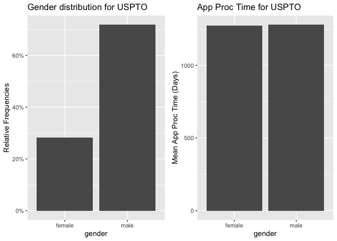

Exercise 4
================

## 0. Data Preprocessing

### Load data

Load the following data: + applications from `app_data_sample.parquet`

``` r
applications <- read_parquet("app_data_sample.parquet")
edges <- read_csv("edges_sample.csv")
```

    ## Rows: 32906 Columns: 4

    ## ── Column specification ────────────────────────────────────────────────────────
    ## Delimiter: ","
    ## chr  (1): application_number
    ## dbl  (2): ego_examiner_id, alter_examiner_id
    ## date (1): advice_date

    ## 
    ## ℹ Use `spec()` to retrieve the full column specification for this data.
    ## ℹ Specify the column types or set `show_col_types = FALSE` to quiet this message.

``` r
applications
```

    ## # A tibble: 2,018,477 × 16
    ##    application_number filing_date examiner_name_last examiner_name_first
    ##    <chr>              <date>      <chr>              <chr>              
    ##  1 08284457           2000-01-26  HOWARD             JACQUELINE         
    ##  2 08413193           2000-10-11  YILDIRIM           BEKIR              
    ##  3 08531853           2000-05-17  HAMILTON           CYNTHIA            
    ##  4 08637752           2001-07-20  MOSHER             MARY               
    ##  5 08682726           2000-04-10  BARR               MICHAEL            
    ##  6 08687412           2000-04-28  GRAY               LINDA              
    ##  7 08716371           2004-01-26  MCMILLIAN          KARA               
    ##  8 08765941           2000-06-23  FORD               VANESSA            
    ##  9 08776818           2000-02-04  STRZELECKA         TERESA             
    ## 10 08809677           2002-02-20  KIM                SUN                
    ## # … with 2,018,467 more rows, and 12 more variables:
    ## #   examiner_name_middle <chr>, examiner_id <dbl>, examiner_art_unit <dbl>,
    ## #   uspc_class <chr>, uspc_subclass <chr>, patent_number <chr>,
    ## #   patent_issue_date <date>, abandon_date <date>, disposal_type <chr>,
    ## #   appl_status_code <dbl>, appl_status_date <chr>, tc <dbl>

``` r
edges
```

    ## # A tibble: 32,906 × 4
    ##    application_number advice_date ego_examiner_id alter_examiner_id
    ##    <chr>              <date>                <dbl>             <dbl>
    ##  1 09402488           2008-11-17            84356             66266
    ##  2 09402488           2008-11-17            84356             63519
    ##  3 09402488           2008-11-17            84356             98531
    ##  4 09445135           2008-08-21            92953             71313
    ##  5 09445135           2008-08-21            92953             93865
    ##  6 09445135           2008-08-21            92953             91818
    ##  7 09479304           2008-12-15            61767             69277
    ##  8 09479304           2008-12-15            61767             92446
    ##  9 09479304           2008-12-15            61767             66805
    ## 10 09479304           2008-12-15            61767             70919
    ## # … with 32,896 more rows

### Get gender for examiners

We’ll get gender based on the first name of the examiner, which is
recorded in the field `examiner_name_first`. We’ll use library `gender`
for that, relying on a modified version of their own
[example](https://cran.r-project.org/web/packages/gender/vignettes/predicting-gender.html).

Note that there are over 2 million records in the applications table –
that’s because there are many records for each examiner, as many as the
number of applications that examiner worked on during this time frame.
Our first step therefore is to get all *unique* names in a separate list
`examiner_names`. We will then guess gender for each one and will join
this table back to the original dataset. So, let’s get names without
repetition:

``` r
library(gender)
#install_genderdata_package() # only run this line the first time you use the package, to get data for it
# get a list of first names without repetitions
examiner_names <- applications %>% 
  distinct(examiner_name_first)
examiner_names
```

    ## # A tibble: 2,595 × 1
    ##    examiner_name_first
    ##    <chr>              
    ##  1 JACQUELINE         
    ##  2 BEKIR              
    ##  3 CYNTHIA            
    ##  4 MARY               
    ##  5 MICHAEL            
    ##  6 LINDA              
    ##  7 KARA               
    ##  8 VANESSA            
    ##  9 TERESA             
    ## 10 SUN                
    ## # … with 2,585 more rows

Now let’s use function `gender()` as shown in the example for the
package to attach a gender and probability to each name and put the
results into the table `examiner_names_gender`

``` r
# get a table of names and gender
examiner_names_gender <- examiner_names %>% 
  do(results = gender(.$examiner_name_first, method = "ssa")) %>% 
  unnest(cols = c(results), keep_empty = TRUE) %>% 
  select(
    examiner_name_first = name,
    gender,
    proportion_female
  )
examiner_names_gender
```

    ## # A tibble: 1,822 × 3
    ##    examiner_name_first gender proportion_female
    ##    <chr>               <chr>              <dbl>
    ##  1 AARON               male              0.0082
    ##  2 ABDEL               male              0     
    ##  3 ABDOU               male              0     
    ##  4 ABDUL               male              0     
    ##  5 ABDULHAKIM          male              0     
    ##  6 ABDULLAH            male              0     
    ##  7 ABDULLAHI           male              0     
    ##  8 ABIGAIL             female            0.998 
    ##  9 ABIMBOLA            female            0.944 
    ## 10 ABRAHAM             male              0.0031
    ## # … with 1,812 more rows

Finally, let’s join that table back to our original applications data
and discard the temporary tables we have just created to reduce clutter
in our environment.

``` r
# remove extra colums from the gender table
examiner_names_gender <- examiner_names_gender %>% 
  select(examiner_name_first, gender)
# joining gender back to the dataset
applications <- applications %>% 
  left_join(examiner_names_gender, by = "examiner_name_first")
# cleaning up
rm(examiner_names)
rm(examiner_names_gender)
gc()
```

    ##            used  (Mb) gc trigger  (Mb) limit (Mb) max used  (Mb)
    ## Ncells  4545834 242.8    7923072 423.2         NA  4871878 260.2
    ## Vcells 49590690 378.4   92565904 706.3     102400 79906235 609.7

### Guess the examiner’s race

We’ll now use package `wru` to estimate likely race of an examiner. Just
like with gender, we’ll get a list of unique names first, only now we
are using surnames.

``` r
library(wru)
examiner_surnames <- applications %>% 
  select(surname = examiner_name_last) %>% 
  distinct()
examiner_surnames
```

    ## # A tibble: 3,806 × 1
    ##    surname   
    ##    <chr>     
    ##  1 HOWARD    
    ##  2 YILDIRIM  
    ##  3 HAMILTON  
    ##  4 MOSHER    
    ##  5 BARR      
    ##  6 GRAY      
    ##  7 MCMILLIAN 
    ##  8 FORD      
    ##  9 STRZELECKA
    ## 10 KIM       
    ## # … with 3,796 more rows

We’ll follow the instructions for the package outlined here
<https://github.com/kosukeimai/wru>.

``` r
examiner_race <- predict_race(voter.file = examiner_surnames, surname.only = T) %>% 
  as_tibble()
```

    ## [1] "Proceeding with surname-only predictions..."

    ## Warning in merge_surnames(voter.file): Probabilities were imputed for 698
    ## surnames that could not be matched to Census list.

``` r
examiner_race
```

    ## # A tibble: 3,806 × 6
    ##    surname    pred.whi pred.bla pred.his pred.asi pred.oth
    ##    <chr>         <dbl>    <dbl>    <dbl>    <dbl>    <dbl>
    ##  1 HOWARD       0.643   0.295    0.0237   0.005     0.0333
    ##  2 YILDIRIM     0.861   0.0271   0.0609   0.0135    0.0372
    ##  3 HAMILTON     0.702   0.237    0.0245   0.0054    0.0309
    ##  4 MOSHER       0.947   0.00410  0.0241   0.00640   0.0185
    ##  5 BARR         0.827   0.117    0.0226   0.00590   0.0271
    ##  6 GRAY         0.687   0.251    0.0241   0.0054    0.0324
    ##  7 MCMILLIAN    0.359   0.574    0.0189   0.00260   0.0463
    ##  8 FORD         0.620   0.32     0.0237   0.0045    0.0313
    ##  9 STRZELECKA   0.666   0.0853   0.137    0.0797    0.0318
    ## 10 KIM          0.0252  0.00390  0.00650  0.945     0.0198
    ## # … with 3,796 more rows

As you can see, we get probabilities across five broad US Census
categories: white, black, Hispanic, Asian and other. (Some of you may
correctly point out that Hispanic is not a race category in the US
Census, but these are the limitations of this package.)

Our final step here is to pick the race category that has the highest
probability for each last name and then join the table back to the main
applications table. See this example for comparing values across
columns: <https://www.tidyverse.org/blog/2020/04/dplyr-1-0-0-rowwise/>.
And this one for `case_when()` function:
<https://dplyr.tidyverse.org/reference/case_when.html>.

``` r
examiner_race <- examiner_race %>% 
  mutate(max_race_p = pmax(pred.asi, pred.bla, pred.his, pred.oth, pred.whi)) %>% 
  mutate(race = case_when(
    max_race_p == pred.asi ~ "Asian",
    max_race_p == pred.bla ~ "black",
    max_race_p == pred.his ~ "Hispanic",
    max_race_p == pred.oth ~ "other",
    max_race_p == pred.whi ~ "white",
    TRUE ~ NA_character_
  ))
examiner_race
```

    ## # A tibble: 3,806 × 8
    ##    surname    pred.whi pred.bla pred.his pred.asi pred.oth max_race_p race 
    ##    <chr>         <dbl>    <dbl>    <dbl>    <dbl>    <dbl>      <dbl> <chr>
    ##  1 HOWARD       0.643   0.295    0.0237   0.005     0.0333      0.643 white
    ##  2 YILDIRIM     0.861   0.0271   0.0609   0.0135    0.0372      0.861 white
    ##  3 HAMILTON     0.702   0.237    0.0245   0.0054    0.0309      0.702 white
    ##  4 MOSHER       0.947   0.00410  0.0241   0.00640   0.0185      0.947 white
    ##  5 BARR         0.827   0.117    0.0226   0.00590   0.0271      0.827 white
    ##  6 GRAY         0.687   0.251    0.0241   0.0054    0.0324      0.687 white
    ##  7 MCMILLIAN    0.359   0.574    0.0189   0.00260   0.0463      0.574 black
    ##  8 FORD         0.620   0.32     0.0237   0.0045    0.0313      0.620 white
    ##  9 STRZELECKA   0.666   0.0853   0.137    0.0797    0.0318      0.666 white
    ## 10 KIM          0.0252  0.00390  0.00650  0.945     0.0198      0.945 Asian
    ## # … with 3,796 more rows

Let’s join the data back to the applications table.

``` r
# removing extra columns
examiner_race <- examiner_race %>% 
  select(surname,race)
applications <- applications %>% 
  left_join(examiner_race, by = c("examiner_name_last" = "surname"))
rm(examiner_race)
rm(examiner_surnames)
gc()
```

    ##            used  (Mb) gc trigger  (Mb) limit (Mb) max used  (Mb)
    ## Ncells  4959151 264.9    7923072 423.2         NA  7923072 423.2
    ## Vcells 53388394 407.4   92565904 706.3     102400 92408288 705.1

### Examiner’s tenure

To figure out the timespan for which we observe each examiner in the
applications data, let’s find the first and the last observed date for
each examiner. We’ll first get examiner IDs and application dates in a
separate table, for ease of manipulation. We’ll keep examiner ID (the
field `examiner_id`), and earliest and latest dates for each application
(`filing_date` and `appl_status_date` respectively). We’ll use functions
in package `lubridate` to work with date and time values.

``` r
library(lubridate) # to work with dates
examiner_dates <- applications %>% 
  select(examiner_id, filing_date, appl_status_date) 
examiner_dates
```

    ## # A tibble: 2,018,477 × 3
    ##    examiner_id filing_date appl_status_date  
    ##          <dbl> <date>      <chr>             
    ##  1       96082 2000-01-26  30jan2003 00:00:00
    ##  2       87678 2000-10-11  27sep2010 00:00:00
    ##  3       63213 2000-05-17  30mar2009 00:00:00
    ##  4       73788 2001-07-20  07sep2009 00:00:00
    ##  5       77294 2000-04-10  19apr2001 00:00:00
    ##  6       68606 2000-04-28  16jul2001 00:00:00
    ##  7       89557 2004-01-26  15may2017 00:00:00
    ##  8       97543 2000-06-23  03apr2002 00:00:00
    ##  9       98714 2000-02-04  27nov2002 00:00:00
    ## 10       65530 2002-02-20  23mar2009 00:00:00
    ## # … with 2,018,467 more rows

The dates look inconsistent in terms of formatting. Let’s make them
consistent. We’ll create new variables `start_date` and `end_date`.

``` r
examiner_dates <- examiner_dates %>% 
  mutate(start_date = ymd(filing_date), end_date = as_date(dmy_hms(appl_status_date)))
```

Let’s now identify the earliest and the latest date for each examiner
and calculate the difference in days, which is their tenure in the
organization.

``` r
examiner_dates <- examiner_dates %>% 
  group_by(examiner_id) %>% 
  summarise(
    earliest_date = min(start_date, na.rm = TRUE), 
    latest_date = max(end_date, na.rm = TRUE),
    tenure_days = interval(earliest_date, latest_date) %/% days(1)
    ) %>% 
  filter(year(latest_date)<2018)
examiner_dates
```

    ## # A tibble: 5,625 × 4
    ##    examiner_id earliest_date latest_date tenure_days
    ##          <dbl> <date>        <date>            <dbl>
    ##  1       59012 2004-07-28    2015-07-24         4013
    ##  2       59025 2009-10-26    2017-05-18         2761
    ##  3       59030 2005-12-12    2017-05-22         4179
    ##  4       59040 2007-09-11    2017-05-23         3542
    ##  5       59052 2001-08-21    2007-02-28         2017
    ##  6       59054 2000-11-10    2016-12-23         5887
    ##  7       59055 2004-11-02    2007-12-26         1149
    ##  8       59056 2000-03-24    2017-05-22         6268
    ##  9       59074 2000-01-31    2017-03-17         6255
    ## 10       59081 2011-04-21    2017-05-19         2220
    ## # … with 5,615 more rows

Joining back to the applications data.

``` r
applications <- applications %>% 
  left_join(examiner_dates, by = "examiner_id")
rm(examiner_dates)
gc()
```

    ##            used  (Mb) gc trigger   (Mb) limit (Mb)  max used   (Mb)
    ## Ncells  4972898 265.6   14366628  767.3         NA  14366628  767.3
    ## Vcells 65766593 501.8  133470900 1018.4     102400 133354949 1017.5

### 1. Create application processing time variable

``` r
attach(applications)
library(lubridate)

# compute the final decision date as either abandon date or patent issue date
application_dates <- applications %>% 
    mutate(decision_date = coalesce(abandon_date,patent_issue_date)) %>%
    select(application_number,filing_date, abandon_date, patent_issue_date, decision_date, examiner_id, examiner_art_unit, gender, race, tenure_days) %>%
    filter(!is.na(decision_date))

head(application_dates)
```

    ## # A tibble: 6 × 10
    ##   application_number filing_date abandon_date patent_issue_date decision_date
    ##   <chr>              <date>      <date>       <date>            <date>       
    ## 1 08284457           2000-01-26  NA           2003-02-18        2003-02-18   
    ## 2 08413193           2000-10-11  NA           2002-08-27        2002-08-27   
    ## 3 08531853           2000-05-17  NA           1997-03-04        1997-03-04   
    ## 4 08637752           2001-07-20  NA           2005-08-09        2005-08-09   
    ## 5 08682726           2000-04-10  2000-12-27   NA                2000-12-27   
    ## 6 08687412           2000-04-28  NA           2001-07-31        2001-07-31   
    ## # … with 5 more variables: examiner_id <dbl>, examiner_art_unit <dbl>,
    ## #   gender <chr>, race <chr>, tenure_days <dbl>

``` r
# compute the application processing time as the difference of filing date and decision date
application_dates <- application_dates %>% 
    #mutate(app_proc_time = decision_date - filing_date)
    mutate(app_proc_time = difftime(decision_date, filing_date, units = "days"))

head(application_dates) #1,688,716 applications
```

    ## # A tibble: 6 × 11
    ##   application_number filing_date abandon_date patent_issue_date decision_date
    ##   <chr>              <date>      <date>       <date>            <date>       
    ## 1 08284457           2000-01-26  NA           2003-02-18        2003-02-18   
    ## 2 08413193           2000-10-11  NA           2002-08-27        2002-08-27   
    ## 3 08531853           2000-05-17  NA           1997-03-04        1997-03-04   
    ## 4 08637752           2001-07-20  NA           2005-08-09        2005-08-09   
    ## 5 08682726           2000-04-10  2000-12-27   NA                2000-12-27   
    ## 6 08687412           2000-04-28  NA           2001-07-31        2001-07-31   
    ## # … with 6 more variables: examiner_id <dbl>, examiner_art_unit <dbl>,
    ## #   gender <chr>, race <chr>, tenure_days <dbl>, app_proc_time <drtn>

It seems some application processing time have negative value
abnormally. Let’s take a look at the distribution.

``` r
# plot the data distribution of application processing time
application_dates %>%
  ggplot(aes(sample = app_proc_time)) +
  geom_qq()
```

    ## Don't know how to automatically pick scale for object of type difftime. Defaulting to continuous.
    ## Don't know how to automatically pick scale for object of type difftime. Defaulting to continuous.

<!-- -->

``` r
# filter out negative and outlying application processing time
application_dates <- application_dates %>% 
    filter(app_proc_time>ddays(0)) %>% 
    filter(app_proc_time<ddays(10000))

head(application_dates) #1,688,672 applications
```

    ## # A tibble: 6 × 11
    ##   application_number filing_date abandon_date patent_issue_date decision_date
    ##   <chr>              <date>      <date>       <date>            <date>       
    ## 1 08284457           2000-01-26  NA           2003-02-18        2003-02-18   
    ## 2 08413193           2000-10-11  NA           2002-08-27        2002-08-27   
    ## 3 08637752           2001-07-20  NA           2005-08-09        2005-08-09   
    ## 4 08682726           2000-04-10  2000-12-27   NA                2000-12-27   
    ## 5 08687412           2000-04-28  NA           2001-07-31        2001-07-31   
    ## 6 08765941           2000-06-23  2001-08-22   NA                2001-08-22   
    ## # … with 6 more variables: examiner_id <dbl>, examiner_art_unit <dbl>,
    ## #   gender <chr>, race <chr>, tenure_days <dbl>, app_proc_time <drtn>

``` r
# plot again the data distribution of application processing time after cleaning
application_dates %>%
  ggplot(aes(sample = app_proc_time)) +
  geom_qq()
```

    ## Don't know how to automatically pick scale for object of type difftime. Defaulting to continuous.
    ## Don't know how to automatically pick scale for object of type difftime. Defaulting to continuous.

<!-- --> Outliers
are removed successfully.

### 2. Estimate relationship between centrality and application processing time

``` r
# before we begin, get the workgroup from art unit as rounding down to digit tenth.
application_dates <- application_dates %>%
  mutate(wg = (application_dates$examiner_art_unit%/%10) * 10)

# Find out which is the dominating workgroup an examiner handled the applications for.
library(plyr)
```

    ## ------------------------------------------------------------------------------

    ## You have loaded plyr after dplyr - this is likely to cause problems.
    ## If you need functions from both plyr and dplyr, please load plyr first, then dplyr:
    ## library(plyr); library(dplyr)

    ## ------------------------------------------------------------------------------

    ## 
    ## Attaching package: 'plyr'

    ## The following objects are masked from 'package:dplyr':
    ## 
    ##     arrange, count, desc, failwith, id, mutate, rename, summarise,
    ##     summarize

    ## The following object is masked from 'package:purrr':
    ## 
    ##     compact

``` r
library(dplyr)
library(lubridate)
application_dates <- mutate(
  application_dates,
  period = case_when(
    filing_date<ymd("2007-01-01") ~ NA_character_,
    filing_date<ymd("2008-01-01") ~ "t0",
    filing_date<ymd("2009-01-01") ~ "t1",
    filing_date<ymd("2010-01-01") ~ "t2",
    filing_date<ymd("2011-01-01") ~ "t3",
    filing_date<ymd("2012-01-01") ~ "t4",
    filing_date<ymd("2013-01-01") ~ "t5",
    filing_date<ymd("2014-01-01") ~ "t6",
    filing_date<ymd("2015-01-01") ~ "t7",
    filing_date<ymd("2016-01-01") ~ "t8",
    TRUE~ NA_character_)
  )

# get number of applications
library(plyr)
examiner_wg_napp <- ddply(application_dates, .(examiner_id, period, wg), nrow)
names(examiner_wg_napp) <- c("examiner_id","period", "wg", "n_applications")

# assume an examiner belong to the wg he/she most frequently handled applications for, if tie take the greater wg
examiner_wg_napp <- examiner_wg_napp[order(examiner_wg_napp$examiner_id, examiner_wg_napp$period, -(examiner_wg_napp$n_applications), -(examiner_wg_napp$wg)), ] ### sort first
examiner_wg <- examiner_wg_napp [!duplicated(examiner_wg_napp[c(1,2)]),]
examiner_wg <- select(examiner_wg, c("examiner_id","wg","period"))
examiner_wg <- drop_na(examiner_wg)

rm(examiner_wg_napp)
```

``` r
# compute average application processing time

cols <- c("examiner_id","period", "wg", "gender", "race", "tenure_days")

examiners <- application_dates %>%
    group_by(across(all_of(cols))) %>%
    dplyr::summarize(mean_app_proc_time = mean(app_proc_time, na.rm=TRUE), n_app = n()) %>%
    drop_na()
```

    ## `summarise()` has grouped output by 'examiner_id', 'period', 'wg', 'gender', 'race'. You can override using the `.groups` argument.

``` r
head(examiners)
```

    ## # A tibble: 6 × 8
    ## # Groups:   examiner_id, period, wg, gender, race [6]
    ##   examiner_id period    wg gender race  tenure_days mean_app_proc_time n_app
    ##         <dbl> <chr>  <dbl> <chr>  <chr>       <dbl> <drtn>             <int>
    ## 1       59012 t0      1710 male   white        4013 1277.087 days         46
    ## 2       59012 t1      1710 male   white        4013 1078.412 days         17
    ## 3       59012 t3      1710 male   white        4013  273.000 days          1
    ## 4       59025 t2      2460 male   Asian        2761 1205.000 days          1
    ## 5       59025 t3      2460 male   Asian        2761 1518.353 days         17
    ## 6       59025 t4      2460 male   Asian        2761 1194.826 days         23

#### compute centrality of examiners

``` r
# subset from applications examiners who belong to the two selected work groups
examiner_aus <- examiners %>%
    filter(period == "t1") %>% 
    #filter(wg == 2450 | wg == 2480) %>%
    select(wg, examiner_id, gender, race, tenure_days, mean_app_proc_time, n_app) %>%
    distinct(examiner_id, .keep_all=TRUE) %>% 
    drop_na() 
```

    ## Adding missing grouping variables: `period`

``` r
head(examiner_aus) #178 #4019
```

    ## # A tibble: 6 × 8
    ## # Groups:   examiner_id, period, wg, gender, race [6]
    ##   period    wg examiner_id gender race  tenure_days mean_app_proc_time n_app
    ##   <chr>  <dbl>       <dbl> <chr>  <chr>       <dbl> <drtn>             <int>
    ## 1 t1      1710       59012 male   white        4013 1078.4118 days        17
    ## 2 t1      1720       59040 female Asian        3542 1091.8333 days         6
    ## 3 t1      1730       59040 female Asian        3542 1572.5833 days        24
    ## 4 t1      2120       59056 male   Asian        6268 1513.1000 days        10
    ## 5 t1      2180       59056 male   Asian        6268  879.1481 days        54
    ## 6 t1      2450       59130 male   Asian        6323  998.4737 days        38

``` r
# subset from edges examiners who belong to the two selected work groups
edges_aus <- edges %>%
  filter(ego_examiner_id %in% examiner_aus$examiner_id) %>%
  filter(alter_examiner_id %in% examiner_aus$examiner_id) %>%
  drop_na() #585

# merge work group information
network <- left_join(edges_aus, examiner_aus, by = c("ego_examiner_id" = "examiner_id"))
colnames(network)[6] <- "ego_examiner_wg"
colnames(network)[7] <- "ego_examiner_gender"
colnames(network)[8] <- "ego_examiner_race"
colnames(network)[9] <- "ego_examiner_tenure"
colnames(network)[10] <- "ego_examiner_appprooctime"
colnames(network)[11] <- "ego_examiner_napp"
network <- subset(network, select = -c(period))
network <- left_join(network, examiner_aus, by = c("alter_examiner_id" = "examiner_id"))
colnames(network)[12] <- "alter_examiner_wg"
colnames(network)[13] <- "alter_examiner_gender"
colnames(network)[14] <- "alter_examiner_race"
colnames(network)[15] <- "alter_examiner_tenure"
colnames(network)[16] <- "alter_examiner_appprooctime"
colnames(network)[17] <- "alter_examiner_napp"
network <- subset(network, select = -c(period))

head(network)
```

    ## # A tibble: 6 × 16
    ##   application_number advice_date ego_examiner_id alter_examiner_… ego_examiner_wg
    ##   <chr>              <date>                <dbl>            <dbl>           <dbl>
    ## 1 09402488           2008-11-17            84356            63519            1650
    ## 2 09445135           2008-08-21            92953            91818            2420
    ## 3 09445135           2008-08-21            92953            91818            2420
    ## 4 09484331           2008-02-07            72253            61519            1630
    ## 5 09484331           2008-02-07            72253            72253            1630
    ## 6 09489652           2008-01-10            67078            75772            2190
    ## # … with 11 more variables: ego_examiner_gender <chr>, ego_examiner_race <chr>,
    ## #   ego_examiner_tenure <dbl>, ego_examiner_appprooctime <drtn>,
    ## #   ego_examiner_napp <int>, alter_examiner_wg <dbl>,
    ## #   alter_examiner_gender <chr>, alter_examiner_race <chr>,
    ## #   alter_examiner_tenure <dbl>, alter_examiner_appprooctime <drtn>,
    ## #   alter_examiner_napp <int>

``` r
# create edge list
edge_list <- select(network, c("ego_examiner_id","alter_examiner_id"))

head(edge_list)
```

    ## # A tibble: 6 × 2
    ##   ego_examiner_id alter_examiner_id
    ##             <dbl>             <dbl>
    ## 1           84356             63519
    ## 2           92953             91818
    ## 3           92953             91818
    ## 4           72253             61519
    ## 5           72253             72253
    ## 6           67078             75772

``` r
# create node list
ego <- select(network, c("ego_examiner_id","ego_examiner_wg")) %>%
    dplyr::rename(id=ego_examiner_id, wg=ego_examiner_wg)
alter <- select(network, c("alter_examiner_id","alter_examiner_wg")) %>%
    dplyr::rename(id=alter_examiner_id, wg=alter_examiner_wg)
nodes <- rbind(ego, alter) %>%
  select(id) %>%
  distinct() %>%
  drop_na() #92

head(nodes)
```

    ## # A tibble: 6 × 1
    ##      id
    ##   <dbl>
    ## 1 84356
    ## 2 92953
    ## 3 72253
    ## 4 67078
    ## 5 91688
    ## 6 61797

``` r
library(igraph)
```

    ## 
    ## Attaching package: 'igraph'

    ## The following objects are masked from 'package:lubridate':
    ## 
    ##     %--%, union

    ## The following objects are masked from 'package:dplyr':
    ## 
    ##     as_data_frame, groups, union

    ## The following objects are masked from 'package:purrr':
    ## 
    ##     compose, simplify

    ## The following object is masked from 'package:tidyr':
    ## 
    ##     crossing

    ## The following object is masked from 'package:tibble':
    ## 
    ##     as_data_frame

    ## The following objects are masked from 'package:stats':
    ## 
    ##     decompose, spectrum

    ## The following object is masked from 'package:base':
    ## 
    ##     union

``` r
advice_net = graph_from_data_frame(d=edge_list, vertices=nodes, directed=TRUE)
advice_net
```

    ## IGRAPH e0647dd DN-- 1519 20803 -- 
    ## + attr: name (v/c)
    ## + edges from e0647dd (vertex names):
    ##  [1] 84356->63519 92953->91818 92953->91818 72253->61519 72253->72253
    ##  [6] 67078->75772 67078->75772 67078->97328 91688->71059 91688->71059
    ## [11] 91688->67669 91688->67669 61797->78036 94270->81337 94270->81337
    ## [16] 94270->66927 94270->66927 94270->66927 94270->66927 73223->92537
    ## [21] 73223->92537 94270->97655 94270->97655 94270->81337 94270->66927
    ## [26] 94270->66927 60128->69459 75772->99395 75772->99395 75772->99395
    ## [31] 75772->99395 75772->99395 75772->99395 75772->99395 75772->99395
    ## [36] 75772->77746 75772->77746 75772->77746 75772->77746 67713->77746
    ## + ... omitted several edges

``` r
# calculate Degree Centrality, a measure for a node in a network is just its degree, the number of edges connected to it. 
V(advice_net)$dc <- degree(advice_net)
# calculate Betweenness Centrality, which measures the extent to which a node lies on paths between other nodes.
V(advice_net)$bc <- betweenness(advice_net)
# calculate Eigenvector Centrality, which awards a number of points proportional to the centrality scores of the neighbors
V(advice_net)$ec <- evcent(advice_net)$vector
V(advice_net)$cc <- closeness(advice_net) # dropped since closeness centrality is not well-defined for disconnected graphs
```

    ## Warning in closeness(advice_net): At centrality.c:2874 :closeness centrality is
    ## not well-defined for disconnected graphs

``` r
# combine the centrality scores
centrality <- data.frame(cbind(nodes$id, V(advice_net)$dc, V(advice_net)$bc, V(advice_net)$ec, V(advice_net)$cc)) 
colnames(centrality)[1] <- "examiner_id"
colnames(centrality)[2] <- "degree_centrality"
colnames(centrality)[3] <- "betweenness_centrality"
colnames(centrality)[4] <- "eigenvector_centrality"
colnames(centrality)[5] <- "closeness_centrality"

head(centrality)
```

    ##   examiner_id degree_centrality betweenness_centrality eigenvector_centrality
    ## 1       84356                18              22.000000           3.688243e-14
    ## 2       92953                 2               0.000000           7.135295e-19
    ## 3       72253                31              94.000000           3.130471e-14
    ## 4       67078                 3               0.000000           2.363416e-14
    ## 5       91688                36               2.149632           3.138051e-13
    ## 6       61797                30               0.000000           9.278463e-12
    ##   closeness_centrality
    ## 1         4.356887e-07
    ## 2         4.342526e-07
    ## 3         4.351123e-07
    ## 4         4.351127e-07
    ## 5         4.342528e-07
    ## 6         5.064945e-07

``` r
# visualize the advice network
# reference: https://www.data-imaginist.com/2017/ggraph-introduction-layouts/
#library(ggraph)
#ggraph(advice_net, layout="kk")+
#  geom_edge_link()+
#  geom_node_point(aes(size=bc, color=nodes$wg), show.legend=T)
```

``` r
# merge centrality to applications
examiner_joined <- left_join(examiner_aus, centrality, by = c("examiner_id" = "examiner_id"))
examiner_joined <- examiner_joined %>%
  drop_na(degree_centrality)

head(examiner_joined) #92
```

    ## # A tibble: 6 × 12
    ## # Groups:   examiner_id, period, wg, gender, race [6]
    ##   period    wg examiner_id gender race  tenure_days mean_app_proc_time n_app
    ##   <chr>  <dbl>       <dbl> <chr>  <chr>       <dbl> <drtn>             <int>
    ## 1 t1      2120       59056 male   Asian        6268 1513.1000 days        10
    ## 2 t1      2180       59056 male   Asian        6268  879.1481 days        54
    ## 3 t1      2160       59141 female Asian        4582 1839.5556 days        18
    ## 4 t1      2160       59181 female black        6331 1324.6038 days        53
    ## 5 t1      1640       59211 male   white        6332 1044.1250 days        56
    ## 6 t1      1730       59227 female white        6349 1270.4176 days        91
    ## # … with 4 more variables: degree_centrality <dbl>,
    ## #   betweenness_centrality <dbl>, eigenvector_centrality <dbl>,
    ## #   closeness_centrality <dbl>

``` r
# housekeeping
rm(examiner_wg)
rm(alter)
rm(ego)
rm(examiner_aus)
rm(edges_aus)
rm(edge_list)
rm(edges)
rm(nodes)
rm(centrality)
```

#### linear regression

``` r
# run linear regression to estimate the relationship between centrality and app_proc_time
mreg = lm(as.numeric(mean_app_proc_time)~degree_centrality+betweenness_centrality+eigenvector_centrality+closeness_centrality,
          data=examiner_joined)
summary(mreg)
```

    ## 
    ## Call:
    ## lm(formula = as.numeric(mean_app_proc_time) ~ degree_centrality + 
    ##     betweenness_centrality + eigenvector_centrality + closeness_centrality, 
    ##     data = examiner_joined)
    ## 
    ## Residuals:
    ##      Min       1Q   Median       3Q      Max 
    ## -1143.82  -376.42    10.36   296.75  1991.84 
    ## 
    ## Coefficients:
    ##                          Estimate Std. Error t value Pr(>|t|)    
    ## (Intercept)             3.965e+02  2.496e+02   1.588 0.112323    
    ## degree_centrality      -8.169e-01  2.143e-01  -3.812 0.000142 ***
    ## betweenness_centrality -1.455e-02  1.216e-02  -1.196 0.231633    
    ## eigenvector_centrality  6.197e+01  3.044e+02   0.204 0.838696    
    ## closeness_centrality    2.060e+09  5.682e+08   3.626 0.000294 ***
    ## ---
    ## Signif. codes:  0 '***' 0.001 '**' 0.01 '*' 0.05 '.' 0.1 ' ' 1
    ## 
    ## Residual standard error: 511.1 on 2193 degrees of freedom
    ## Multiple R-squared:  0.0121, Adjusted R-squared:  0.0103 
    ## F-statistic: 6.716 on 4 and 2193 DF,  p-value: 2.27e-05

Adding one more unit in degree centrality subtracts, on average, mean
application processing time by 0.8169 days, if holding everything else
equal. Adding one more unit in betweenness centrality subtracts, on
average, mean application processing time by 0.01455 days, if holding
everything else equal. Both centrality measures have a negative relation
to the mean application processing time. Comparatively, degree
centrality is of higher statistical significance than between centrality
in shortening the application processing time of an examiner. This means
that a cohesive network around an examiner is important to the
efficiency of processing patent applications, and implies that
application processing is more an non-divergent organizational change
than a divergent change.

Adding one more unit in eigenvector centrality adds, on average, mean
application processing time by 6.197 days, if holding everything else
equal. Adding one more unit in closeness centrality adds, on average,
mean application processing time by 2.060e+09 days, if holding
everything else equal. Both centrality measures have a positive relation
to the mean application processing time of an examiner. This means
having relationship with examiners who have high scores would take
longer processing time, potentially due to more workload assigned, and
the more distant an examiner is with other examiners, the more the
longer the processing time, potentially due to lack of peer support.

``` r
#### linear regression - selected work group 2450 & 2480
#examiner_joined_2wg <- examiner_joined %>%
#  filter(wg == 2450 | wg == 2480)

#mreg2 = lm(as.numeric(mean_app_proc_time)~degree_centrality+betweenness_centrality+eigenvector_centrality+closeness_centrality,
#          data=examiner_joined_2wg)
#summary(mreg2)

#Overall, the effect of centrality is greater for work groups 2450 and 2480 than in the entire USPTO organization. This is potentially due to the nature of applications that require more communications, collaborations and advice seeking in specific domain subjects. 
```

### 3. Impacts of examiner gender

Now, let’s look into how the relationship between centrality and
application processing time differ by examiner gender.

``` r
# male
examiner_joined_m <- examiner_joined %>%
  filter(gender == "male")

mreg3 = lm(as.numeric(mean_app_proc_time)~degree_centrality+betweenness_centrality+eigenvector_centrality+closeness_centrality,
           data=examiner_joined_m)
summary(mreg3)
```

    ## 
    ## Call:
    ## lm(formula = as.numeric(mean_app_proc_time) ~ degree_centrality + 
    ##     betweenness_centrality + eigenvector_centrality + closeness_centrality, 
    ##     data = examiner_joined_m)
    ## 
    ## Residuals:
    ##      Min       1Q   Median       3Q      Max 
    ## -1142.59  -378.30     7.92   300.46  1991.80 
    ## 
    ## Coefficients:
    ##                          Estimate Std. Error t value Pr(>|t|)    
    ## (Intercept)             2.802e+02  2.903e+02   0.965 0.334603    
    ## degree_centrality      -8.802e-01  2.457e-01  -3.583 0.000350 ***
    ## betweenness_centrality -9.571e-03  1.379e-02  -0.694 0.487759    
    ## eigenvector_centrality  1.114e+02  3.853e+02   0.289 0.772633    
    ## closeness_centrality    2.329e+09  6.599e+08   3.530 0.000427 ***
    ## ---
    ## Signif. codes:  0 '***' 0.001 '**' 0.01 '*' 0.05 '.' 0.1 ' ' 1
    ## 
    ## Residual standard error: 514.1 on 1574 degrees of freedom
    ## Multiple R-squared:  0.01484,    Adjusted R-squared:  0.01234 
    ## F-statistic: 5.928 on 4 and 1574 DF,  p-value: 9.828e-05

Adding one more unit in degree centrality subtracts, on average, male’s
mean application processing time by 0.802 days, if holding everything
else equal. Adding one more unit in betweenness centrality subtracts, on
average, male’s mean application processing time by 0.0096 days, if
holding everything else equal.

``` r
# female
examiner_joined_f <- examiner_joined %>%
  filter(gender == "female")

mreg4 = lm(as.numeric(mean_app_proc_time)~degree_centrality+betweenness_centrality+eigenvector_centrality+closeness_centrality,
           data=examiner_joined_f)
summary(mreg4)
```

    ## 
    ## Call:
    ## lm(formula = as.numeric(mean_app_proc_time) ~ degree_centrality + 
    ##     betweenness_centrality + eigenvector_centrality + closeness_centrality, 
    ##     data = examiner_joined_f)
    ## 
    ## Residuals:
    ##    Min     1Q Median     3Q    Max 
    ## -984.8 -363.3    7.5  284.5 1904.2 
    ## 
    ## Coefficients:
    ##                          Estimate Std. Error t value Pr(>|t|)  
    ## (Intercept)             8.366e+02  4.969e+02   1.684   0.0927 .
    ## degree_centrality      -5.641e-01  4.432e-01  -1.273   0.2036  
    ## betweenness_centrality -3.886e-02  2.650e-02  -1.467   0.1430  
    ## eigenvector_centrality -9.777e+01  5.053e+02  -0.193   0.8466  
    ## closeness_centrality    1.042e+09  1.135e+09   0.918   0.3590  
    ## ---
    ## Signif. codes:  0 '***' 0.001 '**' 0.01 '*' 0.05 '.' 0.1 ' ' 1
    ## 
    ## Residual standard error: 504.4 on 614 degrees of freedom
    ## Multiple R-squared:  0.008622,   Adjusted R-squared:  0.002164 
    ## F-statistic: 1.335 on 4 and 614 DF,  p-value: 0.2555

Adding one more unit in degree centrality subtracts, on average,
female’s mean application processing time by 0.564 days (&lt; 0.802 days
of male), if holding everything else equal. Adding one more unit in
betweenness centrality subtracts, on average, female’s mean application
processing time by 0.0389 days (&gt; 0.0096 days of male), if holding
everything else equal.

It is interesting to observe that the degree centrality effect in
reducing application processing time is more in males than females and
the betweenness centrality effect in reducing application processing
time is more in females than males. This shows the different strengths
and preferences on how to get applications processed by gender. Male
examiners are more good at building cohesive network that all examiners
know each other well, while female examiners are more good at bridging
network that they have close examiners in different groups who don’t
know each other well.

To better understand potential reasons and control for other
characteristics of examiner that might influence the relationship, let’s
take a look at the distribution of gender on company level.

``` r
library(ggplot2)
library(scales)  
```

    ## 
    ## Attaching package: 'scales'

    ## The following object is masked from 'package:purrr':
    ## 
    ##     discard

    ## The following object is masked from 'package:readr':
    ## 
    ##     col_factor

``` r
library(gridExtra)
```

    ## 
    ## Attaching package: 'gridExtra'

    ## The following object is masked from 'package:dplyr':
    ## 
    ##     combine

``` r
plot1 <- ggplot(examiner_joined, aes(gender)) + 
          geom_bar(aes(y = (..count..)/sum(..count..))) + 
          scale_y_continuous(labels=scales::percent) +
          ylab("Relative Frequencies") +
          ggtitle("Gender distribution for USPTO")

plot1
```

<!-- -->

It is observed that there is systematic bias in gender for USPTO and
selected work groups that there are more male examiners than female.
Gender shall be taken into consideration in the formulation of
regression overall.

``` r
# consider gender on company level

mreg = lm(as.numeric(mean_app_proc_time)~degree_centrality+betweenness_centrality+eigenvector_centrality+closeness_centrality
          +as.factor(gender)+as.factor(gender)*degree_centrality+as.factor(gender)*betweenness_centrality,
          data=examiner_joined)
summary(mreg)
```

    ## 
    ## Call:
    ## lm(formula = as.numeric(mean_app_proc_time) ~ degree_centrality + 
    ##     betweenness_centrality + eigenvector_centrality + closeness_centrality + 
    ##     as.factor(gender) + as.factor(gender) * degree_centrality + 
    ##     as.factor(gender) * betweenness_centrality, data = examiner_joined)
    ## 
    ## Residuals:
    ##      Min       1Q   Median       3Q      Max 
    ## -1144.75  -374.34     7.57   296.41  1990.14 
    ## 
    ## Coefficients:
    ##                                                Estimate Std. Error t value
    ## (Intercept)                                   4.115e+02  2.503e+02   1.644
    ## degree_centrality                            -6.865e-01  4.129e-01  -1.663
    ## betweenness_centrality                       -4.162e-02  2.657e-02  -1.567
    ## eigenvector_centrality                        4.863e+01  3.066e+02   0.159
    ## closeness_centrality                          2.016e+09  5.700e+08   3.538
    ## as.factor(gender)male                         5.996e+00  2.809e+01   0.213
    ## degree_centrality:as.factor(gender)male      -1.687e-01  4.589e-01  -0.368
    ## betweenness_centrality:as.factor(gender)male  3.391e-02  2.954e-02   1.148
    ##                                              Pr(>|t|)    
    ## (Intercept)                                  0.100354    
    ## degree_centrality                            0.096531 .  
    ## betweenness_centrality                       0.117361    
    ## eigenvector_centrality                       0.873970    
    ## closeness_centrality                         0.000412 ***
    ## as.factor(gender)male                        0.830987    
    ## degree_centrality:as.factor(gender)male      0.713140    
    ## betweenness_centrality:as.factor(gender)male 0.251055    
    ## ---
    ## Signif. codes:  0 '***' 0.001 '**' 0.01 '*' 0.05 '.' 0.1 ' ' 1
    ## 
    ## Residual standard error: 511.3 on 2190 degrees of freedom
    ## Multiple R-squared:  0.01272,    Adjusted R-squared:  0.009567 
    ## F-statistic: 4.032 on 7 and 2190 DF,  p-value: 0.0002133

Adding one more unit in degree centrality subtracts, on average, mean
application processing time by 0.685 days, if holding everything else
equal. Adding one more unit in betweenness centrality subtracts, on
average, mean application processing time by 0.042 days, if holding
everything else equal. Being a male examiner adds, on average, mean
application processing time by 6.00 days, if holding everything else
equal. The interaction terms of gender x centrality has shown that being
a male examiner, the effect of degree centrality is negative and the
effect of betweenness centrality is positive in relation to the mean
application processing time - this supports the robustness of our above
finding per gender that male examiners are more good at building
cohesive network while female examiners are more good at bridging
network.

### 4. Implication for USPTO

Visializing the gender distribution and application processing time by
gender for USPTO.

``` r
plot2 <- ggplot(examiner_joined, aes(gender,mean_app_proc_time)) + 
          geom_bar(posititon="dodge", stat="summary", fun="mean") + 
          ylab("Mean App Proc Time (Days)") +
          #ylim(0,0.65) +
          ggtitle("App Proc Time for USPTO")
```

    ## Warning: Ignoring unknown parameters: posititon

``` r
grid.arrange(plot1,plot2,ncol=2, widths=c(1,1))
```

    ## Don't know how to automatically pick scale for object of type difftime. Defaulting to continuous.

<!-- -->

To USPTO, it is important to understand the fundamental reasons of
gender imbalance within the organization and why male examiners in
general takes 6 more days to process applications. With centrality, we
can conclude that a cohesive network around an examiner is important to
the efficiency of processing patent applications, and implies that
application processing is more an non-divergent organizational change
than a divergent change. From gender impact analysis, we are also aware
of the strengths and working style of females and males that male
examiners are more good at building cohesive network that all examiners
know each other well, while female examiners are more good at bridging
network that they have close examiners in different groups who don’t
know each other well.

With that being said, since the main duty of examiners are processing
applications, it makes sense that naturally more male examiners with
network building capabilities are acquired to perform the day-to-day
task. However, from a gender equity perspective, it is more beneficial
to strike a gender balance to promote organization diversity &
inclusion. To USPTO business, there could be other transformation
projects (divergent changes perhaps) which might require involvement of
examiners on top of business as usual.

Last but not least, analysis on specific work group level and individual
level are strongly recommended to evaluate examiner performance more
fairly. Different metrics apart from application processing time /
efficiency in handling applications shall be included, such as the
quality of applications processing, tenure and promotion, etc.
